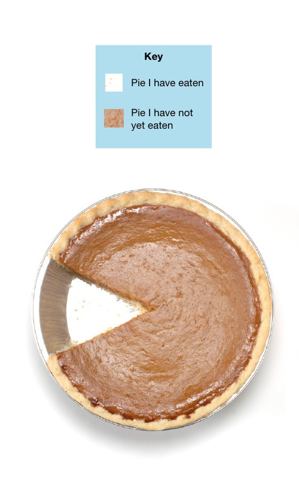
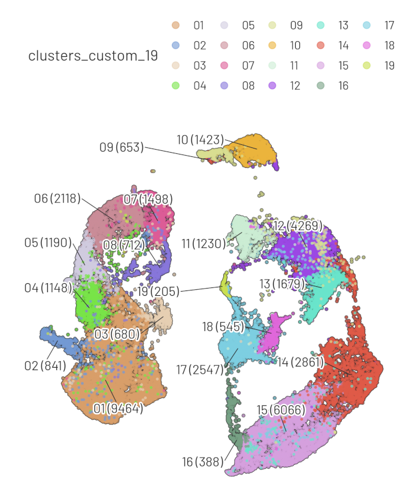
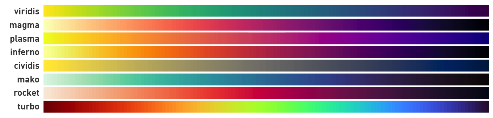
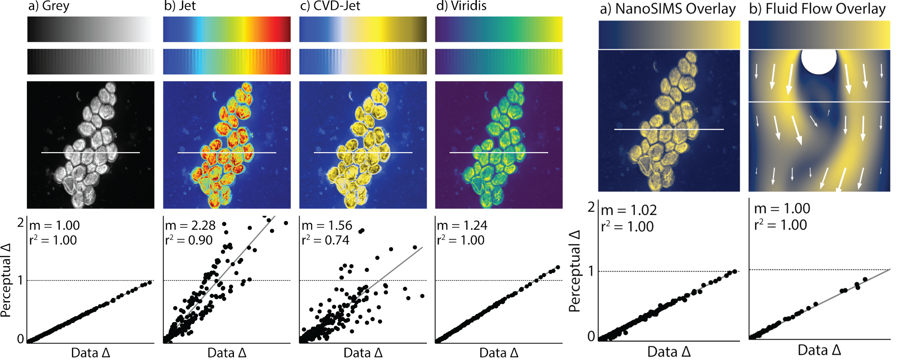
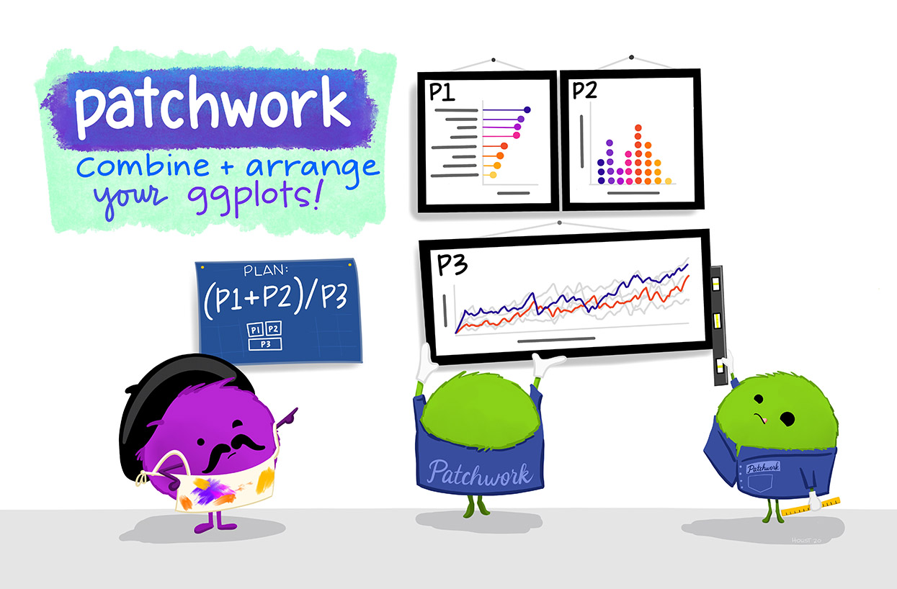

exclude: true
count: false

```{r,echo=FALSE,child="assets/header-presentation.Rmd"}
```

<!-- ----------------- Only edit title & author above this ----------------- -->

```{r,echo=FALSE,message=FALSE,warning=FALSE}
library(dplyr)
library(tidyr)
library(ggplot2)
library(patchwork)
library(ggpointdensity)
library(randomcoloR)
library(ggiraph)
library(plotly)
library(gganimate)
```

---
name: contents

## Contents

- [Disabling legends](#legend-disable-by-aesthetics)
- [Positioning legends](#legend-position)
- [Ordering legends](#legend-ordering)
- [Customising legend formatting](#legend-formatting)
- [Disabling all theme elements](#disable-all-theme)
- [Facets with custom labels](#facet-custom-label-1)
- [Facets with shared background](#facet-shared-background)
- [Overplotting and ordering points](#overplotting-order-points)
- [Overplotting and adding transparency](#overplotting-transparency)
- [Overplotting and binning](#overplotting-bin)
- [Overplotting and 2d density](#overplotting-density-2d)
- [Overplotting and point density](#overplotting-point-density)
- [Types of axes limits](#axes-limits)
- [Overplotting and univariate data](#overplotting-univariate)
- [Discrete and continuous colour palettes](#colour-palette)
- [Discretize continuous variable for clarity](#colour-continuous-discrete)
- [Add additional scales using ggnewscale](#ggnewscale)
- [Combining plots using patchwork](#patchwork-1)
- [Interactive ggplot using plotly](#interactive-ggplotly)
- [Interactive ggplot using ggiraph](#interactive-ggiraph)

---
name: intro

## Syntax

```{r,fig.height=6,fig.width=10}
(p <- ggplot(data=diamonds,mapping=aes(x=price,y=carat,colour=depth,shape=cut))+
  geom_point())
```

[ggplot2 basics](https://nbisweden.github.io/RaukR-2019/ggplot/presentation/ggplot_presentation.html)

---
name: legend-disable-by-aesthetics

## Legend: Disable by aesthetics

```{r,fig.height=3,fig.width=10}
p+guides(colour=FALSE)
```

--

```{r,fig.height=3,fig.width=10}
p+guides(shape=FALSE)
```

???

Legends can be selectively disabled. One way of doing it is through disabling which aesthetics have legends.

---
name: legend-disable-by-geom

## Legend: Disable by geom

.pull-left[
```{r,fig.height=6,fig.width=5.5}
ggplot(diamonds,aes(cut,price))+
  geom_boxplot(aes(fill=color))+
  geom_point(aes(colour=clarity))
```
]

--

.pull-right[
```{r,fig.height=6,fig.width=5.5}
ggplot(diamonds,aes(cut,price))+
  geom_boxplot(aes(fill=color))+
  geom_point(aes(colour=clarity),show.legend=FALSE)
```
]

???

Legends can be selectively disabled. Another way of doing it is through disabling which geoms have legends.

---
name: legend-disable-all

## Legend: Disable all legend

.pull-left-40[

Do we always need legends?



]

--

.pull-right-60[

```{r,fig.height=3,fig.width=8,echo=FALSE}
ggplot(diamonds,aes(cut,price))+
  geom_boxplot(aes(fill=color))+
  facet_grid(~color)
```

```{r,fig.height=3,fig.width=8}
ggplot(diamonds,aes(cut,price))+
  geom_boxplot(aes(fill=color))+
  facet_grid(~color)+
  theme(legend.position="none")
```
]

???

Legends can be completely removed if the figure is self explanatory without the legend.

---
name: legend-position

## Legend: Position

.pull-left[
Default position on the right.

```{r,fig.height=2.7,fig.width=6}
(p <- ggplot(diamonds,aes(price,carat,shape=cut))+
   geom_point())
```

Position legend to the left.

```{r,fig.height=2.7,fig.width=6}
p+theme(legend.position="left")
```
]

--

.pull-right[
Position legend to the top.

```{r,fig.height=2.8,fig.width=6}
p+theme(legend.position="top")
```

Custom position.

```{r,fig.height=2.8,fig.width=6}
p+theme(legend.position=c(0.15,0.6))
```
]

???

The legend(s) can be repositioned as needed to the top, bottom, right or left of the plot. Horizontal and vertical justification can be adjusted as well as direction of the legend. The legend can also be placed directly on the plot area using numeric coordinates. The coordinates range from 0 to 1 (left to right or bottom to top) and unrelated to the data displayed.

---
name: legend-ordering

## Legend: Order

```{r,fig.height=1.7,fig.width=6}
(p <- ggplot(diamonds,aes(price,carat,shape=cut)) + geom_point())
```

--

```{r,fig.height=1.7,fig.width=6}
p+scale_shape_discrete(limits=c("Premium","Good","Very Good","Ideal","Fair"))
```

--

```{r,fig.height=1.7,fig.width=6}
diamonds %>%
  mutate(cut=factor(as.character(cut),levels=c("Premium","Good","Very Good","Ideal","Fair"))) %>%
  ggplot(aes(price,carat,shape=cut)) + geom_point()
```

???

Items (breaks) in the legend can be controlled through scales or the input data directly.

---
name: legend-formatting

## Legend: Formatting

```{r,fig.height=3,fig.width=7}
(p1 <- ggplot(iris,aes(Sepal.Length,Petal.Length,colour=Species))+
      geom_point())
```

--

```{r,fig.height=3,fig.width=7}
p1+guides(colour=guide_legend(title="New title",
                              override.aes=list(size=5)))
```

???

Visual aspects of the legend can be adjusted using `guides()` or through `theme()`.

---
name: disable-all-theme

## Theme: Disable all elements

```{r,fig.height=5,fig.width=10}
ggplot(diamonds,aes(price,carat,colour=color,shape=cut))+
  geom_point()+
  labs(x=NULL,y=NULL)+
  theme(legend.position="none",
        panel.background=element_blank(),
        panel.grid=element_blank(),
        axis.title=element_blank(),
        axis.text=element_blank(),
        axis.ticks=element_blank())
```

???

Theme elements are disabled using `element_blank()`.

---
name: facet-custom-label-1

## Facet: Custom labels

```{r,fig.height=2.4,fig.width=10}
p1 <- ggplot(diamonds,aes(price,carat))+geom_point()
p1+facet_grid(~color)
```

--

```{r,fig.height=2.6,fig.width=10}
labels_color <- c(`D`="Colourless 1",`E`="Colourless 2",`F`="Colourless 3",
            `G`="Near Colourless 1",`H`="Near Colourless 2",`I`="Near Colourless 3",`J`="Near Colourless 4")
p1+facet_grid(~color,labeller=as_labeller(labels_color))
```

???

Facet labels can be renamed using `as_labeller()` function.

---
name: facet-custom-label-2

## Facet: Custom labels

```{r,fig.height=2.5,fig.width=10}
p1 <- ggplot(diamonds,aes(price,carat))+geom_point()
p1+facet_grid(color~clarity)
```

--

```{r,fig.height=3,fig.width=10}
labels_clarity <- c(`I1`="Included 1",`SI1`="Slightly included 1",`SI2`="Slightly included 2",`VS1`="Very slightly included 1",`VS2`="Very slightly included 2",`VVS1`="Very very slightly included 1",`VVS2`="Very very slightly included 2",`IF`="Internally flawless")
p1+facet_grid(color~clarity,labeller=labeller(color=labels_color,clarity=labels_clarity))
```

???

When multiple facet are in use, the labels can be renamed using `labeller()` function.

---
name: facet-shared-background

## Facet: Shared background

```{r,fig.height=2.5,fig.width=9}
ggplot(iris,aes(Sepal.Length,Petal.Length,col=Species))+
  geom_point()+
  facet_grid(~Species)
```

--

```{r,fig.height=2.5,fig.width=9}
ggplot()+
  geom_point(data=select(iris,-Species),aes(Sepal.Length,Petal.Length),col="grey80")+
  geom_point(data=iris,aes(Sepal.Length,Petal.Length,col=Species))+
  facet_grid(~Species)
```

???

Facets split the data into subplots. Sometimes, it is useful to have the complete data displayed on the background for reference. This can be achieved by using a dataframe without the facetting variable.

---
name: overplotting-order-points

## Overplotting: Ordering points

.pull-left[
```{r,fig.height=7,fig.width=6}
ggplot(diamonds,aes(depth,carat,col=price))+
  geom_point()
```
]

--

.pull-right[
```{r,fig.height=3,fig.width=6}
diamonds %>% arrange(price) %>%
  ggplot(aes(depth,carat,col=price))+geom_point()
```

```{r,fig.height=3,fig.width=6}
diamonds %>% arrange(-price) %>%
  ggplot(aes(depth,carat,col=price))+geom_point()
```
]

???

Points are plotted in the order in which they are arranged in the input dataframe. The dataframe can be re-arranged for a different plotting order.

---
name: overplotting-transparency

## Overplotting: Transparency

.pull-left[
```{r,fig.height=7,fig.width=6}
ggplot(diamonds,aes(price,carat))+
  geom_point()
```
]

--

.pull-right[
```{r,fig.height=7,fig.width=6}
ggplot(diamonds,aes(price,carat))+
  geom_point(alpha=0.3)
```
]

???

Adding transparency to the points can help to some extend with low to medium overplotting.

---
name: overplotting-bin

## Overplotting: Binning

.pull-left[
```{r,fig.height=7,fig.width=6}
ggplot(diamonds,aes(price,carat))+
  geom_hex()
```
]

--

.pull-right[
```{r,fig.height=7,fig.width=6}
ggplot(diamonds,aes(price,carat))+
  geom_bin2d()
```
]

???

With extreme amounts of overplotting, binning the data can help to visualise patterns.

---
name: overplotting-density-2d

## Overplotting: 2D density

.pull-left[
```{r,fig.height=7,fig.width=6}
ggplot(diamonds,aes(price,carat))+
  geom_point(alpha=0.3)+
  geom_density2d()
```
]

.pull-right[
```{r,fig.height=7,fig.width=6}
ggplot(diamonds,aes(price,carat))+
  geom_point(alpha=0.2,col="grey70")+
  stat_density_2d(geom="polygon",aes(alpha=..level..),fill="firebrick")
```
]

???

2D density can used to visualise structure in highly overplotted data.

---
name: overplotting-point-density

## Overplotting: Point density

- [Point density](https://github.com/LKremer/ggpointdensity) computes 2d point cloud density and maps the density back to individual points.

```{r,fig.height=5,fig.width=10}
library(ggpointdensity)
(p <- ggplot(diamonds,aes(price,carat))+
        geom_pointdensity()+
        scale_color_viridis_c())
```

???

R package `ggpointdensity()` computes 2D kernal density and maps the density back to the original points.

---
name: axes-limits

## Axes limits

.pull-left[

- Points outside the limits are discarded

```{r,fig.height=3,fig.width=6}
p+scale_x_continuous(limits=c(300,2000))
```

```{r,fig.height=3,fig.width=6}
p+xlim(c(300,2000))
```
]

--

.pull-right[

- All points are retained

```{r,fig.height=3,fig.width=6}
p+coord_cartesian(xlim=c(300,2000))
```

]

???

When "zooming in" on a plot, `coord_cartesian()` retains points outside the plot area while `scale_x_continuous()` discards points outside the plot area.

---
name: overplotting-univariate

## Overplotting: Univariate

.pull-left[
```{r,fig.height=3,fig.width=6}
ggplot(diamonds,aes(cut,price))+geom_point(alpha=0.3)
```

```{r,fig.height=3,fig.width=6}
ggplot(diamonds,aes(cut,price))+geom_jitter(alpha=0.3)
```
]

--

.pull-right[
```{r,fig.height=3,fig.width=6}
ggplot(diamonds,aes(cut,price))+geom_boxplot()
```

```{r,fig.height=3,fig.width=6}
ggplot(diamonds,aes(cut,price))+geom_violin()
```
]

???

For univariate data, jittering the points can help to avoid overplotting. `geom_volin()` can be more informative than `geom_boxplot()` for some datasets.

---
name: colour

## Colours

- Default colours?

```{r,fig.height=2.5,fig.width=6}
ggplot(iris,aes(Petal.Width,Petal.Length,col=Species))+geom_point()
```

--

- Custom colours?

```{r,fig.height=2.5,fig.width=6}
ggplot(iris,aes(Petal.Width,Petal.Length,col=Species))+geom_point()+
  scale_colour_manual(values=c("red","green","blue"))
```

---
name: colour-palette

## Colours: Palette

- [Colorbrewer](https://colorbrewer2.org) `ggplot2::scale_colour_brewer()`
- RColorBrewer

```{r,fig.height=6,fig.width=8}
par(mar=c(0,3,0,0))
RColorBrewer::display.brewer.all()
```

???

[Colorbrewer](https://colorbrewer2.org) is a good source of colours for scientific use.

---
name: colour-custom-palette

## Colours: Custom palettes

```{r,fig.height=1,fig.width=7}
cols <- c("#999999","#E69F00","#56B4E9","#009E73","#F0E442","#0072B2","#D55E00","#CC79A7")
par(mar=c(0.1,0,0.1,0))
barplot(rep(1,length(cols)),col=cols,axes=F)
```

```{r,fig.height=1,fig.width=10}
cols <- c('#FF410DFF','#6EE2FFFF','#F7C530FF','#95CC5EFF','#D0DFE6FF','#F79D1EFF','#748AA6FF',
          "#5C88DAFF","#01948E","#EC687D","#8888FFFF","#FF8989FF")
par(mar=c(0.1,0,0.1,0))
barplot(rep(1,length(cols)),col=cols,axes=F)
```

- [r-color-palette](https://github.com/EmilHvitfeldt/r-color-palettes): Comprehensive list of sources for colour palettes

???

Custom colours can help to make your plots stand out and make your plot look less "default".

---
name: colour-qualitative

## Random qualitative colours

.pull-left[
```{r,fig.height=6,fig.width=6}
(p <- ggplot(iris,aes(Petal.Width,Petal.Length,col=Species))+
        geom_point()+theme_bw())
```
]

--

.pull-right[
```{r,fig.height=6,fig.width=6}
cols <- randomcoloR::distinctColorPalette(3)
p+scale_colour_manual(values=cols)
```
]

???

R package `randomcoloR` is useful to generate random distinct qualitative colours.

---
name: colour-qualitative-2

## Random qualitative colours

.size-60[]

---
name: colour-continuous-1

## Colours: Continuous colours

.pull-left[
- Wide colour range
- Perceptually uniform
- Colourblind friendly
- Visually appealing
]

--

.pull-right[
- Viridis R package [vignette](https://cran.r-project.org/web/packages/viridis/vignettes/intro-to-viridis.html)
- Cividis corrected Viridis colormap [publication](https://journals.plos.org/plosone/article?id=10.1371/journal.pone.0199239)
- Turbo color map [web article](https://ai.googleblog.com/2019/08/turbo-improved-rainbow-colormap-for.html)
]

--

.size-60[]

.size-90[]

???

Modern colour maps are carefully designed to help the viewer perceive the information in the figure as closely as possible to the underlying data.

Some of the considerations for a good colour map

- Wide colour range
- Perceptually uniform
- Colourblind friendly
- Visually appealing

---
name: colour-continuous-2

## Colours: Continuous colours

.pull-left[

```{r,fig.height=3,fig.width=6}
(p <- ggplot(arrange(diamonds,price),aes(depth,carat,col=price))+
        geom_point())
```

```{r,fig.height=3,fig.width=6}
p+scale_colour_viridis_c(option="viridis")
```

]

--

.pull-right[

```{r,fig.height=3,fig.width=6}
p+scale_colour_viridis_c(option="inferno")
```

```{r,fig.height=3,fig.width=6}
p+scale_colour_viridis_c(option="cividis")
```

]

???

Examples showing some of the colour maps.

---
name: colour-continuous-discrete

## Colours: Discretize continuous variables

.pull-left[
```{r,fig.height=3,fig.width=6}
p+scale_colour_viridis_c(option="viridis")
```

```{r,fig.height=3,fig.width=6}
p+scale_colour_viridis_b(option="viridis")
```
]

--

.pull-right[
```{r,fig.height=3,fig.width=6}
diamonds %>%
  mutate(price=cut(price,breaks=c(-Inf,500,1500,10000,Inf),labels=c("Low","Medium","Medium-High","High"))) %>%
  ggplot(aes(depth,carat,col=price))+
        geom_point()
```
]

???

In some situations, categorising the data/colours from a continuous scale to a discrete scale can make it easier to interpret the data.

---
name: ggnewscale

## Additional scales

.pull-left[
```{r,fig.height=5.5,fig.width=6}
ggplot(diamonds,aes(price,carat))+
  geom_point(aes(col=cut))+
  scale_color_viridis_d(option="viridis")+
  geom_smooth(aes(col=clarity))+
  scale_color_viridis_d(option="inferno")
```
]

--

.pull-right[

```{r,fig.height=5,fig.width=6}
library(ggnewscale)
ggplot(diamonds,aes(price,carat))+
  geom_point(aes(col=cut))+
  scale_color_viridis_d(option="viridis")+
  new_scale_color()+
  geom_smooth(aes(col=clarity))+
  scale_color_viridis_d(option="inferno")
```

]

???

R package `ggnewscale` helps you to add additional scales of the same aesthetic.

---
name: patchwork-1

## Combining plots: Patchwork

- [Patchwork](https://patchwork.data-imaginist.com/)

.size-90[]

---
name: patchwork-2

## Combining plots: Patchwork

```{r,fig.height=2.6,fig.width=8}
library(patchwork)
p1 <- ggplot(diamonds,aes(depth,carat,col=clarity))+geom_point()
p2 <- ggplot(diamonds,aes(price,carat,col=clarity))+geom_point()
p1|p2
```

```{r,fig.height=2.6,fig.width=8}
wrap_plots(p1,p2,guides="collect") &
  guides(colour=guide_legend(nrow=1)) &
  theme(legend.position="top")
```

???

R package `patchwork` is a comprehensive solution to combining two or more plots generated from ggplot2.

---
name: patchwork-3

## Combining plots: Patchwork

```{r,fig.height=6.5,fig.width=9}
p3 <- ggplot(diamonds,aes(depth,carat,col=clarity))+geom_point()
(p1|p2)/p3
```

---
name: interactive-ggplotly

## Interactive ggplot: ggplotly

R package `plotly` has a function called `ggplotly` which converts a static ggplot2 object into an interactive plot.

```{r,fig.height=5,fig.width=7}
library(plotly)
p <- ggplot(iris,aes(x=Sepal.Length,y=Sepal.Width,col=Species))+
  geom_point()+
  labs(x="Sepal Length",y="Sepal Width")+
  theme_bw(base_size=12)

plotly::ggplotly(p,width=460,height=360)
```

???

R package `plotly` helps you to add interactivity to a standard ggplot graph with minimal overhead.

---
name: interactive-ggiraph

## Interactive ggplot: ggiraph

- R package [ggiraph](https://davidgohel.github.io/ggiraph/articles/offcran/using_ggiraph.html) converts a static ggplot2 object into an interactive plot.

```{r,fig.height=4,fig.width=6}
library(ggiraph)
p <- ggplot(iris,aes(x=Sepal.Length,y=Petal.Length,colour=Species))+
      geom_point_interactive(aes(tooltip=Species),size=1)+
      theme_bw()

ggiraph(code=print(p),zoom_max=5,tooltip_opacity=0.7,height_svg=2,width_svg=4,width=0.9)
```

<!-- --------------------- Do not edit this and below --------------------- -->

???

R package `ggiraph` also helps you to add interactivity to a standard ggplot graph without too much additional code.

---
name: useful-links

## Useful links

- [ggplot extensions](https://exts.ggplot2.tidyverse.org/)
- [ggplot book](https://ggplot2-book.org/index.html)
- [R graphics cookbook](https://r-graphics.org/)

---
name: end-slide
class: end-slide, middle
count: false

# Thank you. Questions?

```{r,echo=FALSE,child="assets/footer-presentation.Rmd"}
```

```{r,include=FALSE,eval=FALSE}
# manually run this to render this document to HTML
rmarkdown::render("presentation.Rmd")
# manually run this to convert HTML to PDF
#pagedown::chrome_print("presentation.html",output="presentation.pdf")
```
