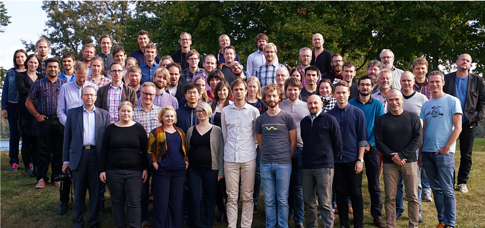
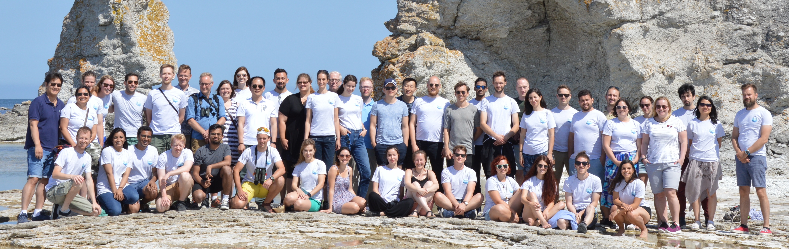
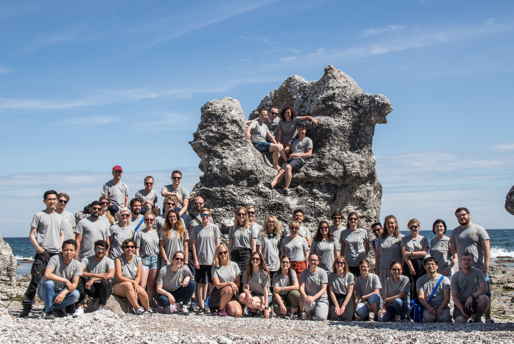

exclude: true
count: false

```{r,echo=FALSE,child="assets/header-presentation.Rmd"}
```

---

name: NBIS
## National Bioinformatics Infrastructure Sweden

* SciLifeLab - one of the three biggest national research infrastructures in Sweden (Mark-IV and ESS)
* NBIS - a SciLifeLab Bioinformatics Platforms
* a national distributed network of around 120 bioinformaticians
* support + training + development  
  
```{r, echo=FALSE}

```

---

name: raukr
## RaukR

* idea born about 2015, crystallized around 2017
* first RaukR in 2018
* in 2018 - 45 participants (30 from Sweden and 15 international)
* subsidized by SciLifeLab
* the first advanced topic course at NBIS
* typically hosted at Campus Gotland, a part of Uppsala University

```{r, echo = FALSE}

```

---

name: raukr-info2
## RaukR - cted. 

* 2018 - 45 participants, 10 teachers, guests: Martin Morgan, Paula Moraga, Olle Jansson, Lové Dalen
* 2019 - 44 participants, 10 teachers, guests: Jenny Bryan, Yihui Xie, Lové Dalen
* 2020 - canceled



---

name: raukr-2021
## RaukR 2021 

* 2021 - 30 participants

--

* teachers:
    + Marcin Kierczak, Uppsala - organiser
    + Sebastian DiLorenzo, Uppsala - organiser
    + Roy Francis, Uppsala - RaukR core staff 
    + Nina Norgren, Umeå - NBIS Training Vice Coordinator
    + Ashfaq Ali, Lund 
    + Mun-Gwan Hong, Stockholm
    + Julie Lorent, Stockholm
    + Nikolay Oskolkov, Lund
    + Björn Viklund, Uppsala
    + Lokeshwaran Manoharan, Lund
    
--

* guest lecturers:
    + Jenny Bryan - RStudio, Hadley Wickham's team
    + Christophe Dervieux - RStudio, Yihui Xie's team
    + Yihui Xie - software engineer at RStudio
    + Max Kuhn, RStudio
    
--

* social media: #RaukR | Twitter | raukr.slack.com | HackMD

---

name: project
## Projects

* either own data or supplied dataset
* a package
* use R markdown
* collaborative effort using GitHub
* assigned tutor
* ideally 3 people per project
* short presentation (~10min per group) on the last day

---

name: session
## Session  

* This presentation was created in RStudio using [`remarkjs`](https://github.com/gnab/remark) framework through R package [`xaringan`](https://github.com/yihui/xaringan).
* For R Markdown, see <http://rmarkdown.rstudio.com>
* For R Markdown presentations, see <https://rmarkdown.rstudio.com/lesson-11.html>

```{r,echo=TRUE}
R.version
```

---

name: end-slide
class: end-slide

# Thank you
