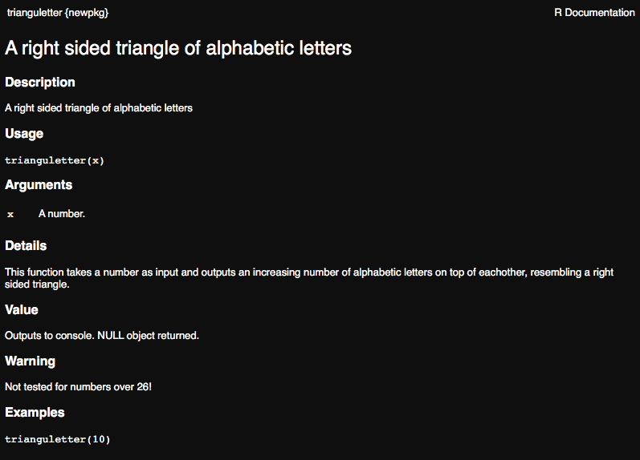
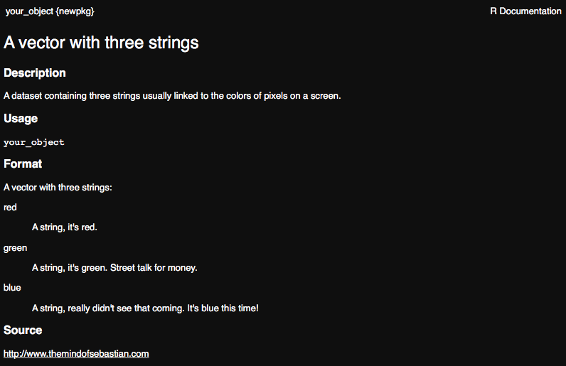
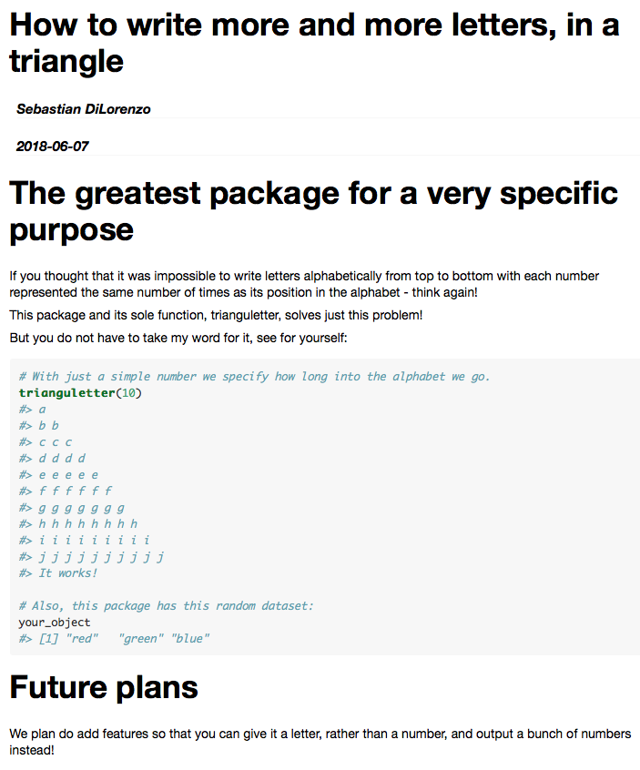
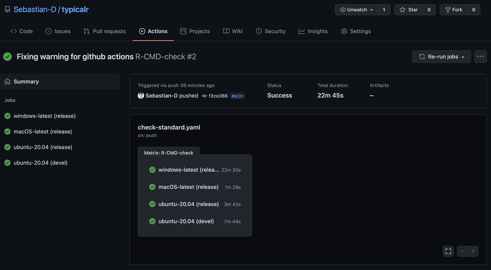

```{r,echo=FALSE,child="assets/header-lab.Rmd"}
```

<!-- ------------ Only edit title, subtitle & author above this ------------ -->

```{r,echo=FALSE,results='hide',warning=FALSE,message=FALSE}
## LIBRARIES AND VARIABLES
# load the packages you need for this document

#library(ggplot2)
#library(tidyverse)
library(devtools)
library(roxygen2)
library(knitr)
library(rmarkdown)

# variables needed in this document
# raukr colours
#rv_col_dark <- "#125687"
#rv_col_light <- "#e7eef3"
```

<div class="spaced abstract">
This is the R packages exercise from RaukR 2021. It will take you through creating an R package with code, data, documentation, creating or generating a correct DESCRIPTION and NAMESPACE, importing packages, checking your package for warnings and using C++ functions through `Rcpp`.

It is fine if you do not have time for the whole thing, as all components may not be important to you. You can always come back later :).
</div>

---

# Installing dependencies

The first thing we want to do is install the dependencies required for the exercise.

```{r,echo=TRUE,eval=FALSE}
install.packages(c("devtools","usethis","roxygen2", "knitr", "rmarkdown", "reshape2", "Rcpp"))
```

If you haven't already, install <a href="https://www.rstudio.com/products/rstudio/download/">Rstudio</a>.

# Create a package backbone

First of all we will create the standard files that are required in an R package. 

<!-- You can do this from within Rstudio **or** using `devtools`. 

## Option 1: In Rstudio -->

Select *File > New Project > New Directory > R package*, give your package a name and click *Create Project*. This should trigger your Rstudio to reload, showing your package name in the top right corner, your packages file structure in the file viewer and a standard **hello.R** R code file in the editor.

<!--
## Option 2: In R devtools suite

```
usethis::create_package("path/to/your/package/packagename")
```

I recommend using the Rstudio interface when working on your R package. To open this package in Rstudio, double click the **.Rproj** file or select it from Rstudio.
-->

# Insert wondrous things

Now that we have a R package backbone lets fill it with stuff!

## R code

Start by editing your **hello.R** file, you can rename it if you wish. Feel free to rewrite the function to perform some simple task. From adding two numbers to creating a basic plot from some input. It's up to you!

Here is an example that I threw together:
```{r, echo=TRUE}
trianguletter <- function(x) {
  for(i in 1:x){
    cat(rep( letters[i], times = i),"\n")
  }
}
```

When you are happy with your function, save it and load it using `devtools::load_all()` or the keyboard shortcut *Ctrl/Cmd + Shift + L*

Now test your function in the console!

```{r,echo=TRUE}
trianguletter(12)
```

**Congratulations!** You have just created an R package that fulfills a function!

## Data

Lets add some data to our package, create an R object with whatever information you want. A string, a vector or a data.frame, as long as you recognise it, it doesn't matter. First we will save it to our **data/** folder using `usethis::use_data()`.

```{r,eval=F}
# A random object
your_object <- c('red','green','blue')

#Save to data
usethis::use_data(your_object)
```

This created the **data/** folder and **your_object.rda** inside it.

<!-- Notice that we are not giving it our packages location. This is because it will default to using the package in the working directory, if your current R session is not in the package root it will complain.

```{r,eval=F}
# Change working directory
setwd("..")

# Try to save data
usethis::use_data(your_object)
# Error: Could not find package root.
```
-->

Now when our package is loaded, `your_object` will be made available to us. To test this, remove all objects from your working directory, and load all functions. Check that you can access the object, despite just removing it from your workspace.

```{r,eval=F}
# Clear workspace
rm(list=ls())

# Load all functions and data from our package
devtools::load_all()

# Check if we can access our saved object
your_object
[1] "red"   "green" "blue"
```

The data in **data/** folder is available to the user, needs to be documented, and is where you would store data if the purpose of your package is to distribute one or more datasets in an R friendly way. If there is some data that you don't want to make easily accessible to the users, AKA not document, but that your functions use, you can put it in **sysdata.rda**. Lets create a second object, like the last one it does not matter what it is. Use the same command as before to save the object, except this time specify that this data is intended for internal use.

```{r,eval=F}
# Create a second object
second_object <- "It works!"

# Save it to R/sysdata.rda
usethis::use_data(second_object, internal = TRUE)
```

To check that this worked, clear your workspace and edit your packages function, the **.R** file, to include the object in some way. Load the package and see if it executes as expected.

```{r,eval=F}
# Clear workspace
rm(list=ls())
```

```{r, echo=TRUE}
# Example .R code edit
trianguletter <- function(x) {
  for(i in 1:x){
    cat(rep( letters[i], times = i),"\n")
  }
  # Check if second object can be called by our function
  cat(second_object)
}
```
```{r, echo=F}
# Create object just for exercise purposes.
second_object <- "It works!"
```

```{r,echo=T,eval=F}
# Load all functions and data from our package
devtools::load_all()
```

```{r,echo=T}
# Test the function
trianguletter(5)
```

Great work! You have created external and internal datasets and shown that they can be used when your package is loaded in the console and in your packages own functions!

## Documentation

Now that we have a function and a dataset, lets use `roxygen2` to create some documentation for them.

### Function documentation

As was discussed in the presentation, the `roxygen2` documentation for a function is directly before it in so called "comment blocks", or `#'`. Here is a brief refresher:

* Comment block : `#'`
* Tags : `@tagname`
  + `@param` : parameter
  + `@example` : examples
  + `@return` : what does the function return. The *value* field in R documentation
  + `@section` : create any section you want
  + `@export` : export the function so it can be used externally

Go ahead and create documentation for your function. Add at least a title, a description, multi-section details, the parameters, the expected return value or output, an example of how to use your function and the export tag.

> Note: The @export tag should always be last in documentation and grants the user access to the function. It is very important!

An example functional documentation:
```{r,echo=T,eval=F}
#' A right sided triangle of alphabetic letters
#'
#' A right sided triangle of alphabetic letters
#'
#' This function takes a number as input and outputs an increasing
#'     number of alphabetic letters on top of eachother, resembling
#'     a right sided triangle.
#' @section Warning:
#' Not tested for numbers over 26!
#'
#' @param x A number.
#' @return Outputs to console. NULL object returned.
#' @examples
#' trianguletter(10)
#' @export
trianguletter <- function(x) {
  for(i in 1:x){
    cat(rep( letters[i], times = i),"\n")
  }
  # Check if second object can be called by our function
  cat(second_object)
}
```

When you are satisfied with your documentation, build it using `devtools::document()`, or *Ctrl/Cmd + Shift + D* in Rstudio. This creates the **.Rd** file in **man/** which is parsed by R when you request the functions documentation. Additionally, the first time you build documentation it will make some edits to your **DESCRIPTION** and check on your **NAMESPACE**.

> Note: You may have gotten a warning message that your NAMESPACE was not generated by roxygen2. This is good behaviour by roxygen2, it doesn't want to change something the user has created a certain way. In this case however, we want the NAMESPACE to be handled by roxygen2, so delete the NAMESPACE file and run `devtools::document()` again to have roxygen2 create it.

Go ahead and preview your function as you would any method and make sure that it looks the way you were expecting.

```{r,echo=T,eval=F}
?trianguletter
```



### Data documentation

Data documentation is a bit different from functional documentation. Remember that you do not need to document datasets not intended for users, so don't worry about **sysdata.rda**. What we want to document in this case is the data you created in **man/your_object.rda**, or whichever name you have given it.

The principle is very similar to functional documentation, but not all tags that are applicable to functions are applicable to data, and should not be used. Similarly, there are some tags that are applicable to data, but not to functions. Usually this is the information you would give a dataset:

* Data documentation
  + Title
  + Description
  + `@format` : what rows and variables are in the data?
  + `@source` : where is the data from?

First of all, lets check what the output of requesting help for your dataset is currently.

```{r}
?your_object
```

As expected, it is undocumented.
Since we cannot add this information to the dataset file, .rda, lets create an R file in **R/** called **data.R** and add the documentation there. The name we document has to be the same name as the dataset object you created earlier. Go ahead and document your dataset now.

```{r,eval=F}
#' A vector with three strings
#'
#' A dataset containing three strings usually linked to the
#'    colors of pixels on a screen.
#'
#' @format A vector with three strings:
#' \describe{
#'   \item{red}{A string, it's red.}
#'   \item{green}{A string, it's green. Street talk for money.}
#'   \item{blue}{A string, really didn't see that coming. It's blue this time!}
#' }
#' @source \url{http://www.themindofsebastian.com}
"your_object"
```

Once you are happy with your documentation, save the file and run `devtools::document()`. Now check the help page for your dataset again.

```{r,echo=T,eval=F}
?your_object
```



Well done! You have successfully created documentation for a function and a dataset and shown that it can be queried within R.

## Vignette

While we are on the topic of documentation, lets check out how to get started writing your vignette. To initialise your vignette run `usethis::use_vignette("packagename_vignette")`.

What this does:

1. Creates the **vignettes/** folder with **packagename_vignettes.Rmd** inside
2. Edits your **DESCRIPTION**, adding `knitr` to `Suggests` and as a `VignetteBuilder`.

Open the file **vignettes/packagename_vignette.Rmd**. Edit the header data, `Vignette Title` and `Vignett Author`, and create a minimal vignette for your function. Do run your function and show your dataset using `knitr` from the vignette. It can be as short as you want, however if you do this for a real package it should be a long form manual showing how your package can use its functions or data to perform the task it was designed for.

> Note: To be able to use the functions of your package in the vignette you will need to install your package, the easiest way is to execute *Cmd/Ctrl + Shift + B*.

To preview your vignette while working on it, press the *knit* button in Rstudio.

Example **vignette.Rmd**:
```{r, eval=F}
        ---
        title: "How to write more and more letters, in a triangle"
        author: "Sebastian DiLorenzo"
        date: "`r Sys.Date()`"
        output: rmarkdown::html_vignette
        vignette: >
          %\VignetteIndexEntry{How to write more and more letters, in a triangle}
          %\VignetteEngine{knitr::rmarkdown}
          %\VignetteEncoding{UTF-8}
        ---

        \```{r setup, include = FALSE}
        knitr::opts_chunk$set(
          collapse = TRUE,
          comment = "#>"
        )

        # replace this with your package name
        library(newpkg)
        \```

        # The greatest package for a very specific purpose

        If you thought that it was impossible to write letters
        alphabetically from top to bottom with each number represented
        the same number of times asits position in the alphabet
         - think again!

        This package and its sole function, trianguletter, solves just this problem!

        But you do not have to take my word for it, see for yourself:
        \```{r,echo=T}
        # With just a simple number we specify how long into the alphabet we go.
        trianguletter(10)

        # Also, this package has this random dataset:
        your_object
        \```

        # Future plans

        We plan do add features so that you can give it
        a letter, rather than a number, and output a
        bunch of numbers instead!

```

> Note: Because I am writing this in rmarkdown I added backslashes before the code or it would not render properly for this exercise instruction. In your rmarkdown there should **not** be backslashes before code chunks.  See the \\``` in the vignette code.

And the beautiful rendered version:<br>


The preview you get when knitting the **vignette.Rmd** does not mean that the vignette has been created. When you are happy with the vignette, use `devtools::build_vignettes()`. To view the vignette as an external user would view it is for some reason a bit of a hassle for the package you are developing, perhaps because the output is pretty much the same as when you knit. If you want to do this you can build your package source *Build>Build source package*, and then install your package from that source. Then view the vignette with `browseVignettes("packagename")`.

Once again, good work! Now you have written a short guide to your package that will be included wherever it goes!

## DESCRIPTION

Now lets take a look at our **DESCRIPTION** file, at this point it should look similar to this:

```
Package: newpkg
Type: Package
Title: What the Package Does (Title Case)
Version: 0.1.0
Author: Who wrote it
Maintainer: The package maintainer <yourself@somewhere.net>
Description: More about what it does (maybe more than one line)
    Use four spaces when indenting paragraphs within the Description.
License: What license is it under?
Encoding: UTF-8
LazyData: true
Depends: 
    R (>= 2.10)
RoxygenNote: 7.1.1
Suggests: 
    rmarkdown,
    knitr
VignetteBuilder: knitr
```

> Note: The information can look slightly different depending on how the package was created, but the information is equivalent. For example you might see `Authors@R` instead of `Author` and `Maintainer`.

Looks pretty good but some information definitely needs to be updated if you are ever going to submit this to a repository.

Update the *Title*, *Author*, *Maintainer*, *Description* and *License* fields.

Just in case you don't want to consider which license to give your package, why not choose one of the most common ones that were mentioned during the lecture?

* MIT : Free, but your license must be included in any following work.
* GPL-3 : Even more free. If someone uses your code, whatever they are doing must also be GPL compatible.
* CC0 : Totally free.

A good place to look at the meaning of licenses is https://tldrlegal.com.

Now that your **DESCRIPTION** is up to shape, we can move on to the **NAMESPACE**.

## NAMESPACE

In the **NAMESPACE** roxygen2 made our function available to the users and made sure that our package works well with other packages.

### Import

First, lets import a function from a package and add its functionality to the function we created.

1. Create a new file called **R/utility.R**. We won't actually put any utility functions there but this is a good place for imports.
2. Next add code to import the `melt` function from `reshape2`. This is in the form `@importFrom pkg function`.

```{r, eval=F}
#' @importFrom reshape2 melt
NULL
```

To update the **NAMESPACE** run `devtools::document()`.

Now your **NAMESPACE** should look like this:
```
# Generated by roxygen2: do not edit by hand

export(trianguletter)
importFrom(reshape2,melt)
```

Great! If the `melt` command from `reshape2` is ever used in your package, it will know which one to use. But for our package to use `reshape2` we first have to import it in **DESCRIPTION**.

Add the `Imports` field somewhere in your **DESCRIPTION**.

```
Imports:
    reshape2
```

While `Imports` means that if someone installs your package it will automatically install `reshape2` as well, regrettably it does not mean that if `reshape2` is missing when we reinstall it locally it will be downloaded and installed. Luckily we installed it at the start of the exercise.

### Testing the imported function

Now that we have added `melt` from `reshape2` lets add it to our function. You can do this any way you like, or copy usage from the example function.

In this example the `head` of `iris` dataset before and after `melt` is viewed, to see that it had an effect.
```{r, eval=T}
#' A right sided triangle of alphabetic letters
#'
#' A right sided triangle of alphabetic letters
#'
#' This function takes a number as input and outputs an increasing
#'     number of alphabetic letters on top of eachother, resembling
#'     a right sided triangle.
#' @section Warning:
#' Not tested for numbers over 26!
#'
#' @param x A number.
#' @return Outputs to console. NULL object returned.
#' @examples
#' trianguletter(10)
#' @export
trianguletter <- function(x) {
  for(i in 1:x){
    cat(rep( letters[i], times = i),"\n")
  }
  # Check if second object can be called by our function
  #cat(second_object)
  #what iris dataset looks like
  cat("before melt:\n")
  print(head(iris))
  #Use melt and see what it looks like
  cat("after melt:\n")
  print(head(melt(iris)))
}
```

Rebuild the package, *Ctrl/Cmd + Shift + B*. Since this loads the package you are working on, `reshape2` should also be loaded. You can check that this is true in `sessionInfo()`.

Test your function, does the output show that it can use `melt`?

Now, lets check that the NAMESPACE is doing what we want it to do, making sure that the correct `melt` is being used by our package. Lets define a new function, also named `melt`, which will be in our global environment.

```{r, eval=T}
melt <- function(x) {
   cat("abc",x)}
```

Now try your function again. Is it using the correct `melt`?

It should be!

Try using `melt(iris)` in your R console, as it is used in your packages function. It should not work. This is because it is using the `melt` function you just defined, and it is getting in the way of using the correct function!

> Note: An alternative way of doing this is using Imports in DESCRIPTION and writing your code with strict package references. In our case `reshape2::melt()`. This way you can circumvent using `roxygen2` to add import tags to `NAMESPACE` if you want.

# Checking your package

Now that we have a pretty complete package, lets run some checks on it. You can use the standard `R CMD check` *pkgname* from your terminal, or you can use `devtools::check()`, which we recommend, as it performs some additional operations such as updating the documentation and bundling the package before checking.

```
R CMD check results
0 errors | 0 warnings | 1 note
checking R code for possible problems ... NOTE
trianguletter: no visible global function definition for ‘head’
trianguletter: no visible binding for global variable ‘iris’
Undefined global functions or variables:
  head iris
Consider adding
  importFrom("datasets", "iris")
  importFrom("utils", "head")
to your NAMESPACE file.
```

Did you get any **NOTE**s, **ERROR**s or **WARNING**s? I know I did! Among other things it didn't like my usage of the `iris` dataset without specifying it in the NAMESPACE. Go ahead and try to fix whichever messages you received. Google if you need to.

On the odd chance that you didn't get any check messages, try introducing an error, like creating an undocumented dataset or using a function that doesn't exist. It's easier to break things than to build them :).

# Finish line

```{r, out.width = "40%", echo=F,fig.align='center'}
knitr::include_graphics("rpackages_lab_assets/small_package.jpg")
```

Well done! You have built a functional package. Maybe it is even time to update the version number in **DESCRIPTION** and take it out of development?

If you want to know even more about this topic, I recommend Hadley Wickhams excellent online resource http://r-pkgs.had.co.nz/check.html

The next two sections are optional and cover including C++ code in your package using `Rcpp` and pushing your R package to github and setting up github actions for it.

# src/ and Rcpp

R is not always the most efficient language, which is why it is great that we can integrate other code with our package. Either using ready made solutions, or by including a script file of another language in the package.

Here we will integrate the well developed `Rcpp` package to be able to use C++ code in our package.

Similarly to how we created the package, the first thing we want to do is setup our package to accept `Rcpp`. We can do this with `usethis::use_rcpp()` which does four things:

1. Creates **src/** folder, unless it already exists.
2. Edits **DESCRIPTION**, adding `Rcpp` to `Imports` and `LinkingTo`.
3. Create and modify **.gitignore** to not include compiled files (useful if you connect your package to git)
4. Let's you know two roxygen tags that need to be included, like our documentation, somewhere in package.

> Note: I received some warnings using `usethis::use_rcpp()` but it didn't seem to break anything.

```
usethis::use_rcpp()
```

Lets include the roxygen tags in our **utility.R** file.

```
#' @useDynLib typicalr, .registration = TRUE
#' @importFrom Rcpp sourceCpp
NULL
```

Now we are ready to create a C++ file. You can do this from Rstudio to generate a nice template, *File > New file > C++ File*. It should look something like this:

```
#include <Rcpp.h>
using namespace Rcpp;

// This is a simple example of exporting a C++ function to R. You can
// source this function into an R session using the Rcpp::sourceCpp
// function (or via the Source button on the editor toolbar). Learn
// more about Rcpp at:
//
//   http://www.rcpp.org/
//   http://adv-r.had.co.nz/Rcpp.html
//   http://gallery.rcpp.org/
//

// [[Rcpp::export]]
NumericVector timesTwo(NumericVector x) {
  return x * 2;
}


// You can include R code blocks in C++ files processed with sourceCpp
// (useful for testing and development). The R code will be automatically
// run after the compilation.
//

/*** R
timesTwo(42)
*/
```

You should not mess with the header, unless you know what you are doing. Here you can write any C++ function you want, either do this or leave it as it is and we will use the included example function, `timeTwo`. The function is exported to R using `// [[Rcpp::export]]`. Importantly, this does not add the function to your **NAMESPACE**. Add documentation to your function in the same way as we have done previously, but with the C++ commenting style of `//`.

```
//' Multiply a number by two
//'
//' @param x A integer.
//' @export
// [[Rcpp::export]]
NumericVector timesTwo(NumericVector x) {
  return x * 2;
}
```

Save the file to your src/ directory and call `pkgbuild::compile_dll()`, which re-compiles the package. This is necessary in this special case due to some recent changes to roxygen. Now run `devtools::document()` to update your **NAMESPACE**. Lets install and restart using *Cmd/Ctrl + Shift + B*. This will create the file **RcppExports.R** in **R/**, which is what R uses to call your C++ function.

Test that your function works from console.

Your R package can now run C++ code, marvelous! Now you just need to learn C++ ;).

## Check again!

> Added a new component to the package have we?
> - Yoda

Perform `devtools::check()` again and fix any new messages.

# Github and Github actions

This section does require some previous git knowledge, which is why it is optional.

## Github

Let's add our R package to github, so we can distribute it! To do this you will need a github account. Since git usage is a bit outside of the scope of this course, you can follow this guide to initiate git in your R package folder, set up a new repo on github and connect them: https://docs.github.com/en/github/importing-your-projects-to-github/importing-source-code-to-github/adding-an-existing-project-to-github-using-the-command-line

Do this now.

At this point, you should have a new repository on your github that has your R package files inside it. This is fantastic! Not only does this mean you can now install your package from any other computer , but we can also setup github actions!

Check that you can install your package directly from the github repository using a command of the form `devtools::install_github("Username/repository_name")`.

## Github actions

> Note: Github actions are only free for public repositories. Do not create a private repository, for example under your organisation, for this exercise!

Let's set up our R package so that it will test if it passes R CMD CHECK on three major operating systems. 
The first thing you will need to do is make sure your github account can use actions/workflows. If you are using a personal access token go to *Settings>Developer settings>Personal access tokens* on your github account and make sure you have selected a *Scope* called *workflow*. 

Now lets add an action to our R-package. It is possible to do this manually but luckily there are some example workflows you can use for the most common cases at https://github.com/r-lib/actions/tree/master/examples.
To add the action, we will use the `usethis` package, similarly to how we used it to initiate vignettes earlier. Issue the command `usethis::use_github_action("check-standard")` in your R package R session, which will select the standard CI workflow from the link.

What this actually did is create the folders and file `.github/workflows/check-standard.yaml` which github will know to look for in a repository for instructions to run actions.

Now commit and push these newly added files to your git repository and hopefully the *Actions* tab on github will commence running an action, checking your R package for compatability with several operating systems!

```{r, echo=F,fig.align='center'}

```

<!-- --------------------- Do not edit this and below ---------------------- -->

```{r,echo=FALSE,child="assets/footer-lab.Rmd"}
```

```{r,eval=FALSE,echo=FALSE}
# manually run this to render this document to HTML
rmarkdown::render("lab.Rmd")
# manually run this to convert HTML to PDF
#pagedown::chrome_print("lab.html",output="lab.pdf")
```
