exclude: true
count: false

```{r,echo=FALSE,child="assets/header-presentation.Rmd"}
```

<!-- ----------------- Only edit title & author above this ----------------- -->

```{r,echo=FALSE,message=FALSE,warning=FALSE}
# load the packages you need

#library(tidyverse)
#library(ggplot2)
library(xaringanExtra)
xaringanExtra::use_panelset()
```


---
name: Types of Analysis

## Different Types of Data Analysis

* Depends on the amount of data we have
* Balance between the numbers of features and observations
 + P is the number of features (genes, proteins, genetic variants etc.)
 + N is the number of observations (samples, cells, nucleotides etc.)

<br/>
.center[
]


---
name: The Curse of Dimensionality

## The Curse of Dimensionality

.pull-left-50[
]

.pull-right-50[

.center[
<span style="color:black">**This is how data looks like in high dimensions:**</span>]
.center[
]


$$Y = \alpha + \beta X$$
$$\beta = \left(X^TX\right)^{-1}X^TY$$

$$\left(X^TX\right)^{-1} \sim \frac{1}{\rm{det}\left(X^TX\right)}\dots\,\rightarrow\,\infty\hbox{,}\,\,\,\,\,\,\,\,n\ll p$$

.center[
<span style="color:red">**Inverted covariance matrix diverges in high dimensions**</span>]


<br/>
$$E[\hat{\sigma}^2]=\frac{n-p}{n}\sigma^2$$

.center[
<span style="color:red">**Maximum Likelihood variance estimator is severely biased in high dimensions**</span>]
]


---
name: Equidistant Points in High Dimensions

## Equidistant Points in High Dimensions

.panelset[
.panel[.panel-name[R Code]
```{r,echo=FALSE,cache=TRUE}
library("sm")
library("MASS")
library("spatstat")
```
```{r}
n <- 1000; 
pair_dist <- list(); 
p <- c(2, 32, 512)

for(i in 1:length(p)) {
  X <- matrix(rnorm(n * p[i]), n, p[i])
  pair_dist[[i]] <- as.vector(dist(X)); 
  pair_dist[[i]] <- pair_dist[[i]] / max(pair_dist[[i]])
}
```
]

.panel[.panel-name[Plot]
```{r Hist_Plot,echo=FALSE,cache=TRUE,fig.width=6,fig.height=4.8,fig.align='center'}
plot(density(pair_dist[[1]]),col="red",main="Pairwise Distances in High Dimensions",xlab="Distance / Max Distance",xlim=c(0,1),ylim=c(0,15))
polygon(density(pair_dist[[1]]), col="red", border="red"); 
lines(density(pair_dist[[2]]),col="green"); polygon(density(pair_dist[[2]]), col="green", border="green") 
lines(density(pair_dist[[3]]),col="blue"); polygon(density(pair_dist[[3]]), col="blue", border="blue") 
legend("topleft",c("2","32","512"),fill=c("red","green","blue"),inset=.02,title="N dims"); mtext("n = 1000 data points")
```
]]

---
name: Neighboring Points in High Dimensions

## Neighboring Points in High Dimensions

.panelset[
.panel[.panel-name[R Code]
```{r}
n <- 1000
first_dist <- vector()
mid_dist <- vector()
last_dist <- vector() 
num_dim <- 2 ^ seq(1, 10, by=1)
for(p in num_dim) {
  X <- matrix(rnorm(n*p), n, p) 
  dist_X <- sort(as.vector(dist(X)), decreasing=FALSE)
  first_dist <- append(first_dist, dist_X[1])
  mid_dist <- append(mid_dist, dist_X[round(length(dist_X)/2, 0)])
  last_dist <- append(last_dist, dist_X[length(dist_X)])
}
```
]

.panel[.panel-name[Plot]
```{r Neighbors Plot,echo=FALSE,cache=TRUE,fig.width=6,fig.height=4.7,fig.align='center'}
plot(log10(num_dim),log10(first_dist),col="red",xlab="Log10 ( Number of Dimensions )",ylab="Log10 ( Distance )",type="o",pch=19,main="Distances between neighboring points in high dimensions")
points(log10(num_dim),log10(mid_dist),col="green",type="o",pch=19)
points(log10(num_dim),log10(last_dist),col="blue",type="o",pch=19)
legend("bottomright",c("First Neighbor","Middle Neighbor","Furthest Neighbor"), fill=c("red","green","blue"),inset=.02); mtext("n = 1000 data points")
```
]]

---
name: Low Dimensional Space

## Low Dimensional Space

```{r}
set.seed(123) 
n <- 20 # number of samples
p <- 2  # number of features / dimensions
Y <- rnorm(n)
X <- matrix(rnorm(n*p),n,p) 
summary(lm(Y~X))
```


---
name: Going to Higher Dimensions

## Going to Higher Dimensions

```{r}
set.seed(123456); n <- 20; p <- 10
Y <- rnorm(n); X <- matrix(rnorm(n*p),n,p); summary(lm(Y~X))
```


---
name: Even Higher Dimensions

## Even Higher Dimensions

```{r}
set.seed(123456); n <- 20; p <- 20
Y <- rnorm(n); X <- matrix(rnorm(n*p),n,p); summary(lm(Y~X))
```


---
name: High dimensional data in Life Sciences

## High dimensional data in Life Sciences

* Proteomics, metabolomics: 50 - 100
* Metagenomics: 100 - 500
* Transcriptomics: 20 000
* Microscopy imaging: 1 000 000
* Genomics, epigenomics: 30 000 000

.center[
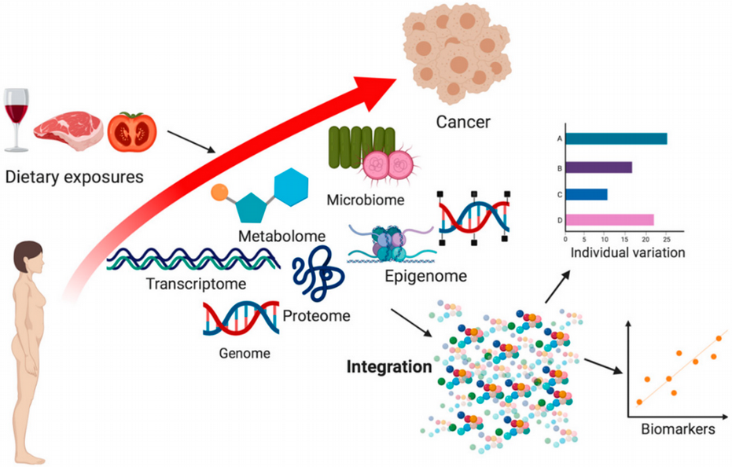]


---
name: Ways to Overcome The Curse of Dimensionality

## Ways to Overcome The Curse of Dimensionality

* Increasing sample size - often cannot afford
* Dimensionality reduction - PCA, UMAP etc.
* Regularizations - LASSO, Ridge, Elasitc Net, Dropout etc.
* Bayesian statistics - Prior plays a role of Regularization

<br/>
.center[
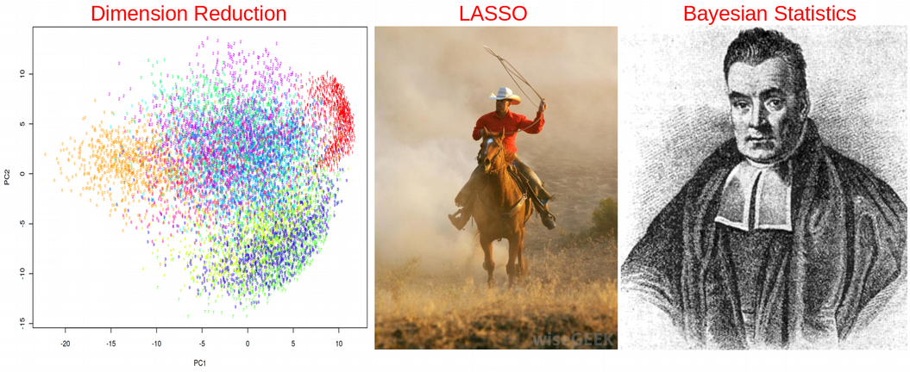]


---
name: Dimensionality Reduction

## Dimensionality Reduction

.center[
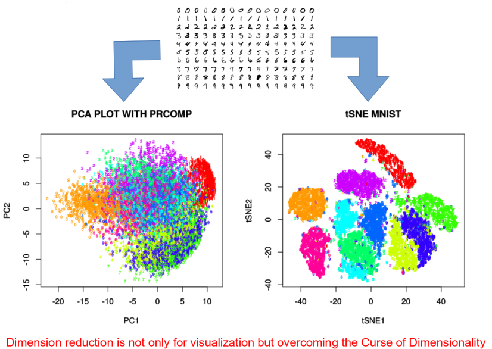]


---
name: Dimension Reduction: Matrix Factorization

## Dimension Reduction: Matrix Factorization

.center[
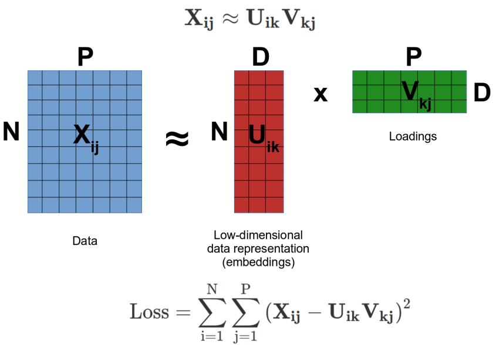]


---
name: Dimension Reduction: Neighborhood Graph

## Dimension Reduction: Neighborhood Graph

.center[
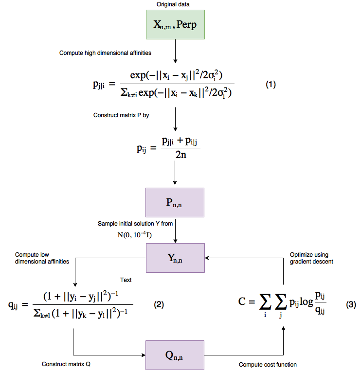]

---
name: Regularizations: LASSO

## Regularizations: LASSO

$$Y = \beta_1X_1+\beta_2X_2+\epsilon \\
\textrm{OLS} = (Y-\beta_1X_1-\beta_2X_2)^2 \\
\textrm{Penalized OLS} = (Y-\beta_1X_1-\beta_2X_2)^2 + \lambda(|\beta_1|+|\beta_2|)$$

.center[
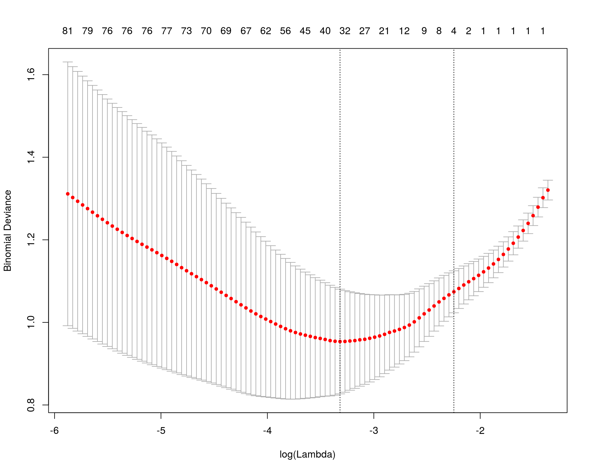]


---
name: K-Fold Cross-Validation

## Regularizations: K-Fold Cross-Validation

.center[
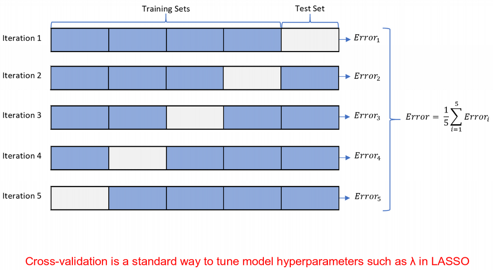]


---
name: Priors in Bayesian Statistics - Regularizations

## Priors in Bayesian Statistics - Regularizations

$$Y = \beta_1X_1+\beta_2X_2+\epsilon$$
* **Maximum Likelihood** principle: maximize probability to observe data given parameters:
$$Y \sim N(\,\beta_1X_1+\beta_2X_2, \sigma^2\,) \\
\rm{L}\,(\,\rm{Y} \,|\, \beta_1,\beta_2\,) =
\frac{1}{\sqrt{2\pi\sigma²}} \exp^{-\frac{(Y-\beta_1X_1-\beta_2X_2)^2}{2\sigma²}}$$

--
* **Bayes theorem**: maximize posterior probability to observe parameters given data:
$$P(\rm{parameters} \,|\, \rm{data})=\frac{L(\rm{data} \,|\, \rm{parameters})*P(\rm{parameters})}{\int{L(\rm{data} \,|\, \rm{parameters})*P(\rm{parameters}) \, d(\rm{parameters})}}$$
--
$$P(\, \beta_1,\beta_2 \,|\, \rm{Y}\,) \sim \rm{L}\,(\,\rm{Y} \,|\, \beta_1,\beta_2\,)*P(\beta_1,\beta_2) \sim \exp^{-\frac{(Y-\beta_1X_1-\beta_2X_2)^2}{2\sigma²}}*\exp^{-\lambda(|\beta_1|+|\beta_2|)}$$
$$-\log{P(\, \beta_1,\beta_2 \,|\, \rm{Y}\,)} \sim (Y-\beta_1X_1-\beta_2X_2)^2 + \lambda(|\beta_1|+|\beta_2|)$$
--
<br/>
* LASSO is a form of Bayes theorem with Laplace prior


---
name: Moving from Statistics to Machine Learning

## Moving from Statistics to Machine Learning

A few peculiarities of data analysis that are typical for Machine Learning:

* Very focused on **prediction** instead of biomarker discovery
* Focus on **cross-validation** and regularizations
* More **algorithmic** and less "pen-and-paper" derivations
* More **Python** speaking than R speaking community

.center[
]


---
name: Statistics vs. Machine Learning

## Statistics vs. Machine Learning


.center[
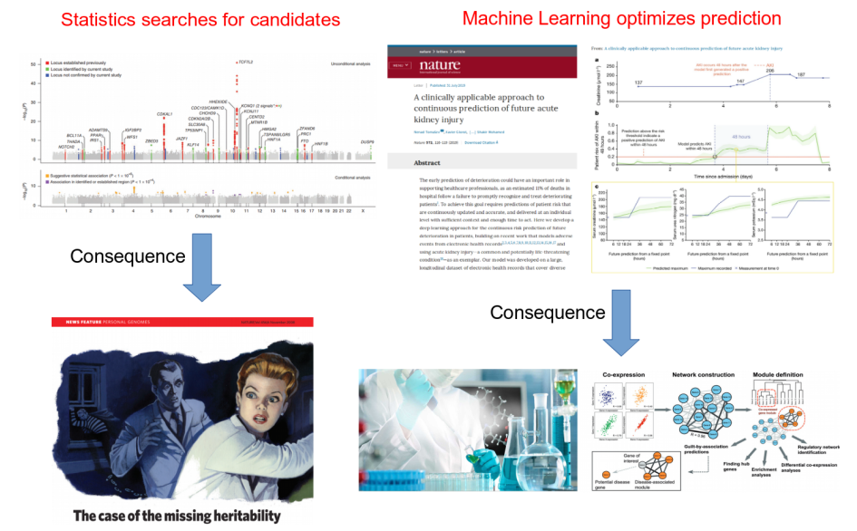]


---
name: How does Machine Learning work?

## How does Machine Learning work?

Machine Learning by default involves five basic steps:

1. Split data set into **train**, **validation** and **test** subsets.
2. Fit the model on the train subset.
3. Validate your model on the validation subset.
4. Repeat steps 1-3 a number of times and tune **hyperparameters**.
5. Test the accuracy of the optimized model on the test subset.

.center[
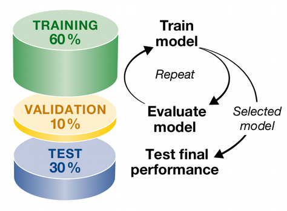]


---
name: Toy Example of Machine Learning

## Toy Example of Machine Learning

```{r,fig.width=6,fig.height=4.6,fig.align='center'}
set.seed(12345)
N<-100
x<-rnorm(N)
y<-2*x+rnorm(N)
df<-data.frame(x,y)
plot(y~x,data=df, col="blue")
```

---
name: Toy Example: Train and Test Subsets

## Toy Example: Train and Test Subsets

We randomly assign 70% of the data to training and 30% to test subsets: 

```{r}
set.seed(123)
train<-df[sample(1:dim(df)[1],0.7*dim(df)[1]),]
test<-df[!rownames(df)%in%rownames(train),]
```

```{r,echo=FALSE,fig.width=6,fig.height=4.6,fig.align='center'}
df$color[rownames(df)%in%rownames(train)]<-"blue"
df$color[rownames(df)%in%rownames(test)]<-"red"
plot(y~x,data=df,col=df$color)
legend("topleft",c("Train","Test"),fill=c("blue","red"),inset=0.02,bty="n")
abline(lm(y~x,data=train),col="blue")
```

---
name: Toy Example: Validation of Model

## Toy Example: Validation of Model

```{r,fig.width=6,fig.height=4.6,fig.align='center'}
test_predicted<-as.numeric(predict(lm(y~x,data=train),newdata=test))
plot(test$y~test_predicted,ylab="True y",xlab="Pred y",col="red")
abline(lm(test$y~test_predicted),col="darkgreen")
```

---
name: Toy Example: Validation of Model (Cont.)

## Toy Example: Validation of Model (Cont.)

```{r}
summary(lm(test$y~test_predicted))
```

Thus the model explains 79% of variation on the test subset.


---
name: What is a Hyperparameter?

## What is a Hyperparameter?

* Hyperparameters are Machine Learning design parameters that are set before the learning process starts
* For the toy model above, a hyperparameter can be e.g. the number of covariates to adjust the main variable x of interest for

```{r}
set.seed(1)
for(i in 1:10)
{
  df[,paste0("PC",i)]<-1*(1-i/10)*y+rnorm(N)
}
head(df)
```


---
name: How does Cross-Validation work?

## How does Cross-Validation work?

* We should not include all PCs - this can be prone to overfitting
* Cross-Validation is a way to combat overfitting

```{r}
train<-df[sample(1:dim(df)[1],0.6*dim(df)[1]),]
val_test<-df[!rownames(df)%in%rownames(train),]
validate<-val_test[sample(1:dim(val_test)[1],0.25*dim(val_test)[1]),]
test<-val_test[!rownames(val_test)%in%rownames(validate),]
```
```{r,echo=FALSE,fig.width=6,fig.height=4.8,fig.align='center'}
df$color[rownames(df)%in%rownames(train)]<-"blue"
df$color[rownames(df)%in%rownames(validate)]<-"red"
df$color[rownames(df)%in%rownames(test)]<-"green"
plot(y~x,data=df,col=df$color)
legend("topleft",c("Train","Validate","Test"),fill=c("blue","red","green"),inset=0.02,bty="n")
abline(lm(y~x,data=train),col="blue")
```


---
name: How does Cross-Validation work? (Cont.)

## How does Cross-Validation work? (Cont.)

* Fit linear regression model on training set and assess the error on validation set
* Error: root mean square difference between y predicted by the trained model on the validation set, and the true y from the validation set
* Looks like no dramatic decrease of RMSE after PC2

```{r,echo=FALSE,fig.width=6,fig.height=4.6,fig.align='center'}
set.seed(1)

train_and_validate<-df[sample(1:dim(df)[1],0.7*dim(df)[1]),]
test<-df[!rownames(df)%in%rownames(train_and_validate),]

N_cv<-100
error<-vector()

error_null<-vector()
for(j in 1:N_cv)
{
  train<-train_and_validate[sample(1:dim(train_and_validate)[1],(6/7)*dim(train_and_validate)[1]),]
  validate<-train_and_validate[!rownames(train_and_validate)%in%rownames(train),]
  error_null<-append(error_null,sqrt(sum((predict(lm(y~x,data=train),newdata=validate)-validate$y)^2)/dim(validate)[1]))
}
error<-append(error,mean(error_null))

for(j in 1:10)
{
  error_at_pc<-vector()
  formula<-as.formula(paste0("y~x+",paste0("PC",seq(1:j),collapse="+")))
  for(i in 1:N_cv)
  {
    train<-train_and_validate[sample(1:dim(train_and_validate)[1],(6/7)*dim(train_and_validate)[1]),]
    validate<-train_and_validate[!rownames(train_and_validate)%in%rownames(train),]
    error_at_pc<-append(error_at_pc,sqrt(sum((predict(lm(formula,data=train),newdata=validate)-validate$y)^2)/dim(validate)[1]))
  }
  error<-append(error,mean(error_at_pc))
}
plot(error~seq(from=0,to=10,by=1),type='o',xlab="PRINCIPAL COMPONENTS",ylab="RMSE")
```


---
name: Ultimate Model Evaluation

## Ultimate Model Evaluation

* Thus optimal model is y~x+PC1+PC2
* Perform final evaluation of the optimized / trained model on the test data set and report the final evaluation metric, adjusted R squared in our case
* The model explains over 90% of variation on the unseen test data set

```{r}
summary(lm(predict(lm(y~x+PC1+PC2,data=train),newdata=test)~test$y))
```


---
name: From Linear Models to ANNs

## From Linear Models to ANNs

* ANN: Mathematical algorithm / function Y = f(X) with special architecture

* Highly non-linear dues to activation functions

* Backward propagation for minimizing error 

.center[
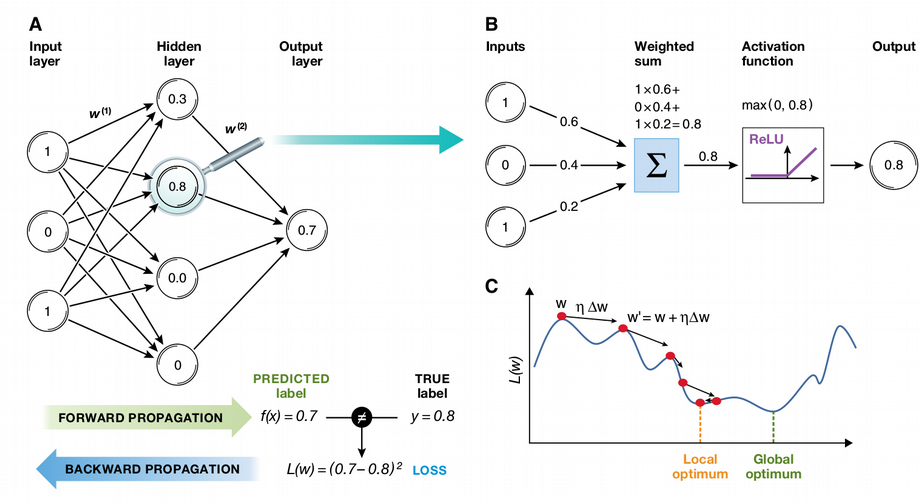]


---
name: Universal Approximation Theorem

## Universal Approximation Theorem


.center[
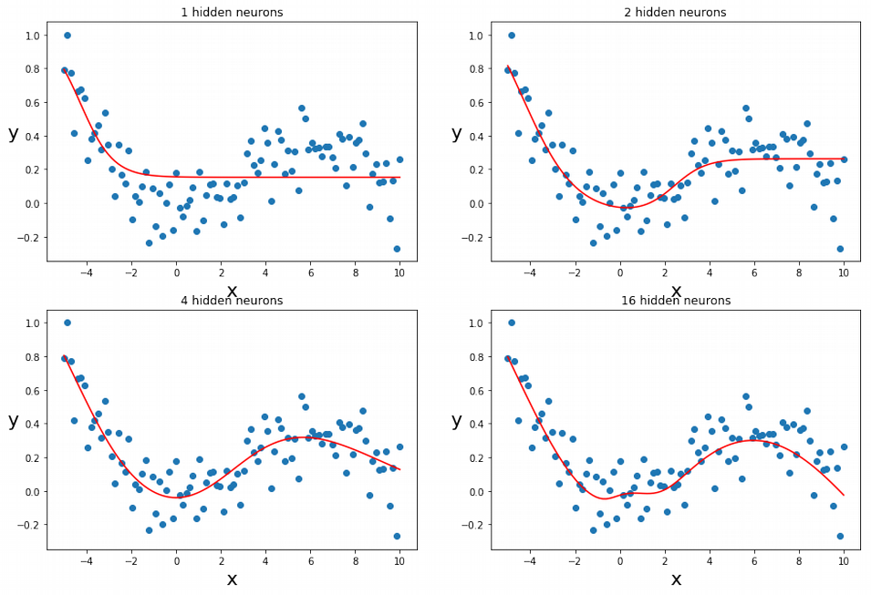]


---
name: Single Cells make Big Data

## Single Cells make Big Data

.center[
]


<!-- --------------------- Do not edit this and below --------------------- -->

---
name: end-slide
class: end-slide, middle
count: false

# Thank you. Questions?

```{r,echo=FALSE,child="assets/footer-presentation.Rmd"}
```

```{r,include=FALSE,eval=FALSE}
# manually run this to render this document to HTML
rmarkdown::render("presentation.Rmd")
# manually run this to convert HTML to PDF
#pagedown::chrome_print("presentation.html",output="presentation.pdf")
```
