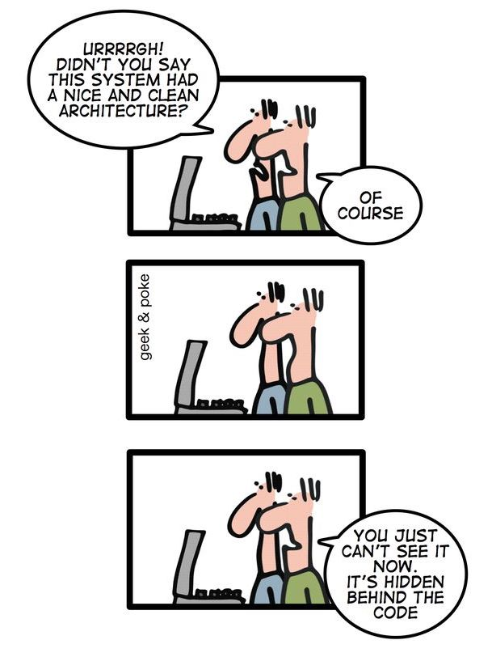

exclude: true
count: false

```{r,echo=FALSE,child="assets/header-presentation.Rmd"}
```

<!-- ----------------- Only edit title & author above this ----------------- -->

```{r setup,include=FALSE}
knitr::opts_chunk$set(dev="CairoPNG",results="hold",fig.show="hold",fig.align="left",echo=TRUE,warning=FALSE,message=FALSE)

# report related
library(knitr)
library(markdown)
library(rmarkdown)
```

```{r,echo=FALSE,message=FALSE,warning=FALSE}
# only load the packages you need

# data handling
library(dplyr)
library(tidyr)
library(stringr)

# tables
library(kableExtra) # complete table
library(formattable) # table with conditional formatting
library(DT) # interactive table

# graphics
library(ggplot2) # static graphics

# interactive graphics
library(highcharter)
library(plotly)
library(ggiraph) # convert ggplot to interactive
library(dygraphs) # time series
library(networkD3) # network graph
library(leaflet) # interactive maps
library(crosstalk) # linking plots
library(emo)
```

--- 
name: empty
## 

---

name: learning-outcomes
## Learning Outcomes
<br><br>
After this module:

* you will be aware of different coding styles

--

* you will know what styles are good `r emo::ji('good')` and bad `r emo::ji('bad')` and why `r emo::ji('question')`

--

* you will know how to decompose a problem before you even start coding

--

* you will understand when there is time for writing a function

--

* your code will reach new level of awesomeness! `r emo::ji('cool')`

---

name: overview
## Topics of This Presentation
<br><br>
Today with Marcin, Mun-Gwan and Ash:
<br>

* **style** &mdash; __howTo_style.yourCode?

* **structure** &mdash; how to think `r emo::ji('thinking')` about the code and manufacture your own building `r emo::ji('construction')` blocks

--

Tomorrow with Ash and Marcin:

* **debugging** &mdash; my code does not run `r emo::ji('sad')`

* **profiling** &mdash; now it does run but... out of memory `r emo::ji('bomb')`

* **optimization** &mdash; making things better `r emo::ji('worker')`

--

On Wednesday with Sebastian and Marcin:

* **vectorization** &mdash; more details on optimization via vectorization `r emo::ji('arrow')`

* **parallelization** &mdash; run things in parallel, rule them all! `r emo::ji('ring')`

---

name: coding-style
## What is Coding Style?

* naming conventions &mdash; assigning names to variables 

* code formatting &mdash; placement of braces, use of white space characters etc.
.center[
<br>
.vsmall[From: [Behind The Lines](http://geekandpoke.typepad.com/geekandpoke/2010/09/behind-the-lines.html) 2010-09-23. By Oliver Widder, Webcomics Geek And Poke.]
]
---

name: naming-conventions
## Naming Conventions

A syntactically valid name:

* consists of:
  + letters: ``r paste0(paste0(letters, collapse=''), paste0(LETTERS, collapse=''))``
  + digits: ``r paste(0:9, collapse='')``
  + period: `.`
  + underscore: `_`

* begins with a letter or the period (`.`) **not** followed by a number

* cannot be one of the *reserved words*: `if`, `else`, `repeat`, `while`, `function`, `for`, `in`, `next`, `break`, `TRUE`, `FALSE`, `NULL`, `Inf`, `NaN`, `NA`, `NA_integer_`, `NA_real_`, `NA_complex_`, `NA_character_`

* also cannot be: `c`, `q`, `t`, `C`, `D`, `I` as they are reserved function names.
---

name: naming-styles
## Naming Style

Variable names that are legal are not necessarily a good style and they may be dangerous `r emo::ji('danger')`:

```{r logical_values, echo=TRUE}
F
T
```

```{r the_TF_trap, echo=TRUE}
F + T  
```

```{r the_TF_trap_cted, echo=TRUE}
F <- 3  
F + T  
```

```{r reset_false, include=FALSE}
T <- TRUE
F <- FALSE
```
do not do this! 
--
unless you are a politician `r emo::ji('suit')`...
<br><br><br>
.center[.large[Avoid `T` and `F` as variable names.]]
---

## Customary Variable Names
Also, there is a number of variable names that are traditionally used to name particular variables:

* `usr` &mdash; user
* `pwd` &mdash; password
* `x`, `y`, `z` &mdash; vectors
* `w` &mdash; weights
* `f`, `g` &mdash; functions
* `n` &mdash; number of rows
* `p` &mdash; number of columns
* `i`, `j`, `k` &mdash; indexes
* `df` &mdash; data frame
* `cnt` &mdash; counter
* `M`, `N`, `W` &mdash; matrices
* `tmp` &mdash; temporary variables

Sometimes these are domain-specific:

* `p`, `q` &mdash; allele frequencies in genetics,
* `N`, `k` &mdash; number of trials and number of successes in stats
<br><br>
.center[.large[Try to avoid use these in this way to avoid possible confusion.]]
---

## Different Notations
People use different notation styles throughout their code:

--

* `snake_notation_looks_like_this`
--

* `camelNotationLooksLikeThis`

--

* `period.notation.looks.like.this`

--

but many also use...

--

* `LousyNotation_looks.likeThis`

--

Try to be consistent and stick to one of them. Bear in mind `period.notation` is used by S3 classes to create generic functions, e.g. `plot.my.object`. A good-enough reason to avoid it?

.center[***]

--

It is also important to maintain code readability by having your variable names:
* informative, e.g. `genotypes` vs. `fsjht45jkhsdf4`

--

* consistent across your code &mdash; the same naming convention

--

* not too long, e.g. `weight` vs. `phenotype.weight.measured`

--

* in the period notation and the snake notation avoid `my.var.2` or `my_var_2`, use `my.var2` and `my_var2` instead
---

## Special Variable Names
Few more things to consider:

* There are built-in variable names: 

  + `LETTERS`: the 26 upper-case letters of the Roman alphabet

  + `letters`: the 26 lower-case letters of the Roman alphabet

  + `month.abb`: the three-letter abbreviations for the English month names

  + `month.name`: the English names for the months of the year

  + `pi`: the ratio of the circumference of a circle to its diameter
  
* Variable names beginning with period are **hidden**: `.my_secret_variable` `r emo::ji('ghost')` will not be shown but can be accessed

```{r hidden_vars, echo=TRUE}
.the_hidden_answer <- 42
ls()
```

--

but with a bit of effort you can see them:
```{r show_hidden_vars, echo=TRUE}
ls(all.names = TRUE)
```

---
name: structuring_your_code
## Structure Your Code

Decompose the problem `r emo::ji('puzzle')` `r emo::ji('puzzle')`!

.center[


<br>
.vsmall[source: Wikimedia Commons]
]

--

* *divide et impera* / top-down approach &mdash; split your BIG problem into a number of small sub-problems recursively and, **at some level**, encapsulate your code in functional blocks (functions)

* a function should be performing a small task, it should be a logical program unit

**when should I write a function `r emo::ji('question')`**

* one screen `r emo::ji('screen')` rule (resolution...),
* re-use twice rule of `r emo::ji('thumbs_up')`.

consider creating an S4 or even an R6 class &mdash; data-type safety!

---
name: how_to_write_functions
## How to write functions

* avoid accessing and modifying globals 
    + avoid `r emo::ji('no')` `a <<- 42`
    + and `r emo::ji('yes')` use a closure instead

--

```{r closure_for_global}
new_counter <- function() {
  i <- 0
  function() {
    # do something useful, then ...
    i <<- i + 1
    i
  }
}

counter1 <- new_counter()
counter2 <- new_counter()
counter1()
counter1()
counter2()
```
.small[based on Stackoverflow [answer](https://stackoverflow.com/questions/2628621/how-do-you-use-scoping-assignment-in-r)]

---
name: how_to_write_functions2
## How to write functions

* use **data** as the **very first** argument for `%>%` pipes sake: 
    + `myfun <- function(x, arg)` `r emo::ji('yes')`
    + `myfun <- function(arg, x)` `r emo::ji('no')`

--

* set arguments to defaults &mdash; better too many args than too few:
    + `myfun <- function(x, seed = 42)` `r emo::ji('yes')`
    + `myfun <- function(x, ...)` `r emo::ji('no')`

--

* remember that global defaults can be changed by `options`

--

* if you are re-using functions wtitten by someone else &mdash; write a wrapper function around them
```{r wrapper-fn, eval=T, fig.height=3, fig.width=4, bty='n'}
my_awesome_plot <- function(...) {
  plot(..., col='red', pch=19, cex.axis=.7, las=1)
}
my_awesome_plot(1:5)
```
---

name: how_to_write_functions3
## How to write functions

* showing progress and messages is good, but let the others turn this functionality off

--

* if you are calling other functions, consider using `...`

<br><br>

--

.center[
<br>
.vsmall[source: http://www.xkcd/com/292]
]

---
name: end-slide
class: end-slide

<h2 style="color:#fff"> Thank you</h2>
