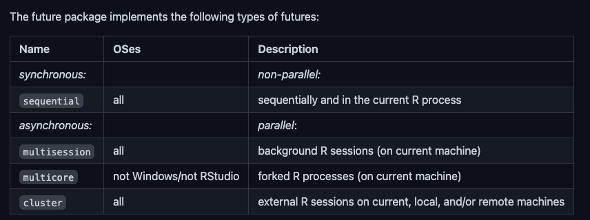

exclude: true
count: false

```{r,echo=FALSE,child="assets/header-presentation.Rmd"}
```

<!-- ----------------- Only edit title & author above this ----------------- -->

```{r,echo=FALSE,message=FALSE,warning=FALSE}
# load the packages you need

library(future)
#library(tidyverse)
#library(ggplot2)
```
---
name: overview

## Overview

.pull-left-50[
* [Parallelisation](#par)
* [future](#fut)
* [plans](#pla)
 + [sequential](#seq)
 + [multisession/multicluster](#mul)
 + [cluster](#clu)
]

.pull-right-50[

.vsmall[https://github.com/HenrikBengtsson/future]
]

???
Future package has backup packages, for example future.batchtools which provides access to cluster functions, like slurm, torque, SGE and LSF.
Futures are evaluated in a local environment, meaning that you cant change variables in there. Like in functions.

Recently published article.
The big thing about futures is that it seems to support most infrastructures and it is written in a way where you are not deciding which infrastructure the user has, which parallel and foreach did. Finish with info that he has described this in detail for those that want to know more. 

---
name: par

## Parallelisation

.pull-left-50[
<br><br><br><br>

]

.pull-right-30[
<br>
* Save time by doing atomic tasks in parallel
<br><br>
* Divide tasks or datasets into smaller pieces
<br><br>
* Can bottleneck if tasks are directly dependent
]


???

---
name: fut

## R-package: future

Other packages decide the parallelisation method during development. With future the code is the same and the USER decides parallelisation method.

* Very simple
* Uniform code, no matter the strategy
* User defined parallelisation
* Unblocked R process during resolving of futures process
* Works well on multiple architectures

<br><br>
Published 2021-06-08 in "The R Journal": 
[A Unifying Framework for Parallel and Distributed Processing in R using Futures](https://journal.r-project.org/archive/2021/RJ-2021-048/RJ-2021-048.pdf)

???
R package developers rarely know who the end-users are and what compute resources they have. With future, instead of programming for one architecture, the code should work on most architectures. We will get back to the Unblocked R process during resolving but basically what it means is that even if multiple things are being computed in parallel the R code can continue unblocked until the resolved values are needed.


Text from article:
The state of a future can either be unresolved or resolved. As soon as it is resolved, the value is available instantaneously. If the value is queried while the future is still unresolved, the current process is blocked until the future is resolved.

R package developers rarely know who the end-users are and what compute resources they have. Regardless, developers who wish to support parallel processing still face the problem of deciding which parallel framework to target, a decision which often has to be done early in the development cycle. This means deciding on what type of parallelism to support,
This decision is critical because it limits the end-user’s options and any change, later on, might be expensive because of, for instance, having to rewrite and retest part of the codebase. A developer who wishes to support multiple parallel backends has to implement support for each of them individually and provide the end-user with a mechanism to choose between them.

--

<br><br>
Building block:
`variable %<-% {expression(s)}`

---
name: pla

## Plans



???
Synchronus:
existing or occurring at the same time.

Asynchronus:
Not occurring or existing at the same time


Sequential: One after another. Default. Very useful when developing the code the first time.

multisession: All operating systems. Evaluated in background R sessions. Number of sessions decided by availableCores().

multicore: operating systems supporting forking of processes, all except windows. Forks existing R process rather than creating new sessions. Max forks decided by availableCores().

Cluster: Cluster environment, such as HPC. Uses package parallel

---
name: seq

## plan(sequential)
<br>
Building block:
`variable %<-% {expression(s)}`

--

```{r, eval = F}
future::plan(sequential)

a %<-% {
  Sys.sleep(3)
  a <- 1
}
b %<-% {
  Sys.sleep(3)
  b <- 2
}

a + b
```

???
In programming, a future is an abstraction for a value that may be available at some point in the future. The state of a future can either be unresolved or resolved. As soon as it is resolved, the value is available instantaneously. If the value is queried while the future is still unresolved, the current process is blocked until the future is resolved. It is possible to check whether a future is resolved or not without blocking. 

--

```{r, eval = T, echo = F}
plan(sequential)

p1 <- proc.time()
a %<-% {
  Sys.sleep(3)
  a <- 1
}
b %<-% {
  Sys.sleep(3)
  b <- 2
}
a + b
print(proc.time() - p1)
```

---
name: mul

## plan(multisession) & plan(multicore)

```{r, eval = F}
plan(multicore)

a %<-% {
  Sys.sleep(3)
  a <- 1
}
b %<-% {
  Sys.sleep(3)
  b <- 2
}

a + b
```


--

```{r, eval = T, echo = F}
plan(multicore)

p1 <- proc.time()
a %<-% {
  Sys.sleep(3)
  a <- 1
}
b %<-% {
  Sys.sleep(3)
  b <- 2
}

a + b
print(proc.time() - p1)
```

```{r, eval = F, echo = F}
## [1] 3
##    user  system elapsed 
##   0.060   0.068   3.298 
```

???
Note: To compute plan(multicore) the rmarkdown must be rendered from terminal r console, as rstudio does not support multicore. rmarkdown::render("parallelisation_Sebastian.Rmd")

--

.pull-right-50[
```{r, eval = T}
availableCores()
```
]

---
## plan(multisession) & plan(multicore)

```{r, eval = F}
plan(multicore)

a %<-% {
  Sys.sleep(3)
  a <- 1
}
b %<-% {
  Sys.sleep(3)
  b <- 2
}
c %<-% {
  Sys.sleep(3)
  c <- 3
}

...

}
k %<-% {
  Sys.sleep(3)
  e <- 5
}

a + b + c + d + e + f + g + h + j + k
```

--

```{r, eval = T, echo = F}
plan(multicore)

p1 <- proc.time()
a %<-% {
  Sys.sleep(3)
  a <- 1
}
b %<-% {
  Sys.sleep(3)
  b <- 2
}
c %<-% {
  Sys.sleep(3)
  c <- 3
}
d %<-% {
  Sys.sleep(3)
  d <- 4
}
e %<-% {
  Sys.sleep(3)
  e <- 5
}
f %<-% {
  Sys.sleep(3)
  f <- 6
}
g %<-% {
  Sys.sleep(3)
  g <- 7
}
h %<-% {
  Sys.sleep(3)
  h <- 8
}
i %<-% {
  Sys.sleep(3)
  i <- 9
}
j %<-% {
  Sys.sleep(3)
  j <- 10
}
k %<-% {
  Sys.sleep(3)
  k <- 5
}

a + b + c + d + e + f + g + h + i + j + k
print(proc.time() - p1)
```

```{r, eval = F, echo = F}
## [1] 15
##    user  system elapsed 
##   0.193   0.261   6.371 
```

---
name: clu

## plan(cluster)

* To some degree a wrapper around `parallel::makeCluster()`
* For example:
  + 3 connected nodes (computers) named `n1:n3`
  + Each with 16 CPUs

```{r, eval = F, echo = T}
plan(cluster, workers = c("n1", "n2", "n3"))
```

--

Specialized r package for interfacing with common HPC job schedulers exists:
`future.batchtools`

???
Work in progress. Say you have access to three nodes, n1:n3. This will then create a set of copies of R running in parallel and communicating over sockets between them.

I have not tried this yet, as it is one thing to need to work in parallel with for example 8 or 16 cores on the HPC, but another use case to need 3 whole nodes for example.

<!-- --------------------- Do not edit this and below --------------------- -->

---
name: end-slide
class: end-slide, middle
count: false

# Thank you. Questions?

```{r,echo=FALSE,child="assets/footer-presentation.Rmd"}
```

```{r,include=FALSE,eval=FALSE}
# manually run this to render this document to HTML
rmarkdown::render("presentation.Rmd")
# manually run this to convert HTML to PDF
#pagedown::chrome_print("presentation.html",output="presentation.pdf")
```
