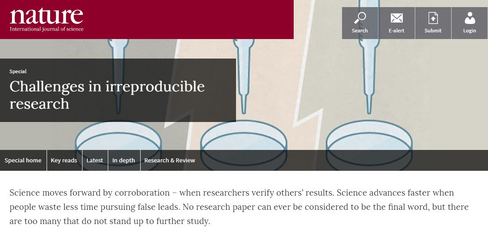
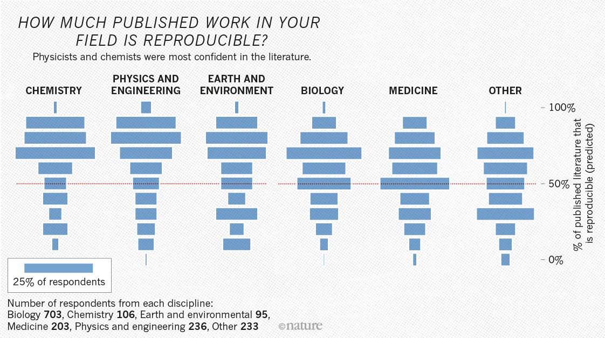
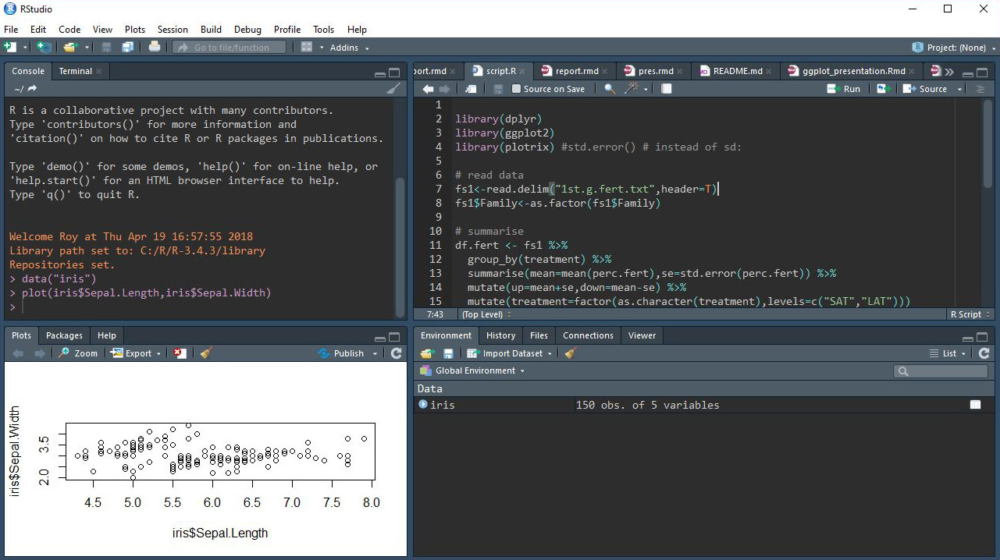
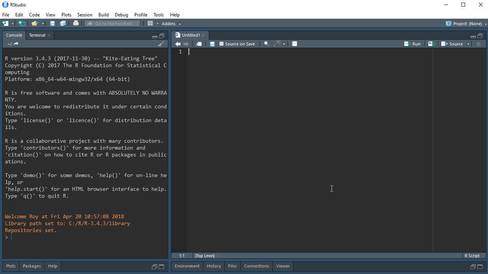
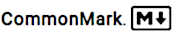
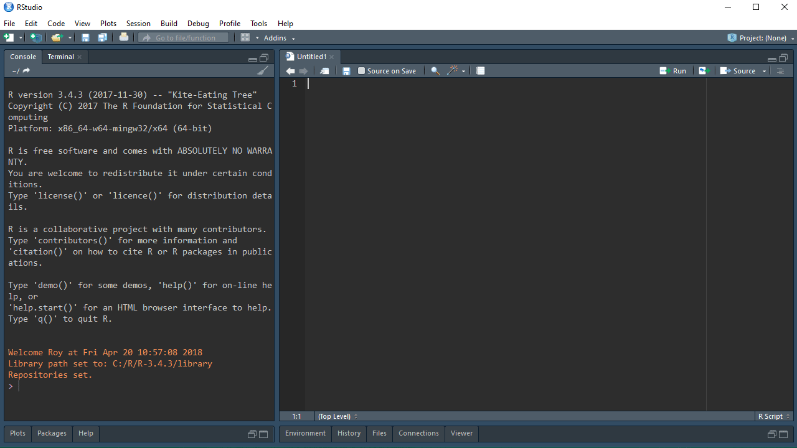
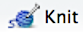
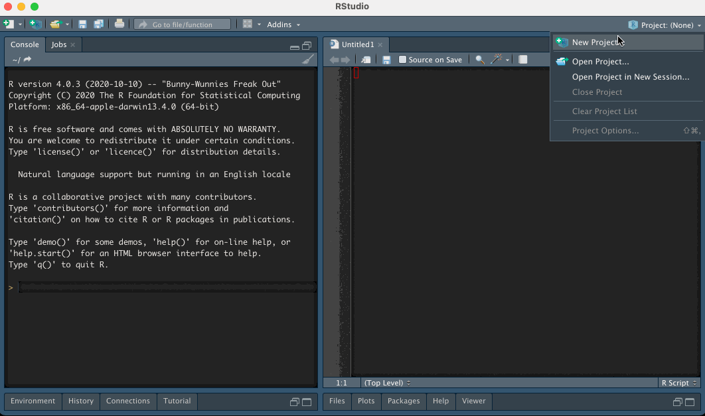
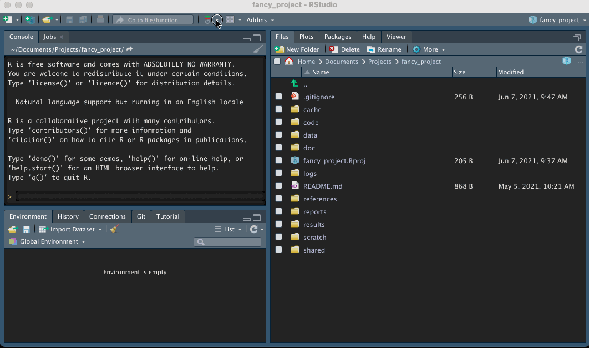

exclude: true
count: false

```{r,echo=FALSE,child="assets/header-presentation.Rmd"}
```

<!-- ----------------- Only edit title & author above this ----------------- -->

```{r,echo=FALSE,message=FALSE,warning=FALSE}
# load packages
library(dplyr)
library(ggplot2)
library(kableExtra) # for table
library(gridExtra) # multiple plot alignment
library(janitor)

# not loaded but, but used
#library(ggpubr)
#library(cowplot)

#colors
rv_col_dark <- "#125687"
rv_col_light <- "#e7eef3"
```
---

name: topics

## Topics

* Reproducibility
* Environment
* RStudio
* Markdown/Rmarkdown
* Reports and presentations in R

---
name: fuss

## What's all the fuss about?

  
.small[<https://www.nature.com/collections/prbfkwmwvz/>]  

  
.small[<https://www.nature.com/news/1-500-scientists-lift-the-lid-on-reproducibility-1.19970>]  

???

A large percentage of research is not reproducible by other researchers or by the original researchers themselves. This concern has been lately addressed by several high profile journals.

---

  
  

---

## What is reproducibility?

> "reproducibility refers to the **ability** of a researcher **to duplicate the results** of a prior study using the same materials as were used by the original investigator. That is, a second researcher might use the same raw data to build the same analysis files and implement the same statistical analysis in an attempt to yield the same results…"

.small[K. Bollen, J. T. Cacioppo, R. Kaplan, J. Krosnick, J. L. Olds, Social, Behavioral, and Economic Sciences Perspectives on Robust and Reliable Science (National Science Foundation, Arlington, VA, 2015)]

.small[Goodman, S. N., Fanelli, D., & Ioannidis, J. P. A. (2016). What does research reproducibility mean? Science Translational Medicine, 8(341), 341ps12–341ps12. http://doi.org/10.1126/scitranslmed.aaf5027]

---

## Reproducibility in R

  

.small[from Turing way (<https://the-turing-way.netlify.app/reproducible-research/overview/overview-definitions.html>)]

---
class: spaced

## Typical workflow

1. Get data
2. Clean, transform data in spreadsheet
3. Copy-paste, copy-paste, ...
4. Run analysis & make figures
5. Write up a report attaching the figures
6. Need to modify the source data/analysis
7. Go back to step 2, Repeat
8. (after a couple of months) Need to fix the figures
9. Ask to myself which data I'm supposed to use now? (`data-final3` or `data-refined2`)
10. Realize the number of samples didn't match
11. Back to step 2, try to remember why some data was modified manually before

--

* (a couple of years later) "I got these figures from you. Could you modify them?"
.size-30[]

???

Manually handling workflow is hard to reproduce because it is hard to know the exact step carried out. A programmatic workflow allows full transparency to the exact steps followed.

---
class: spaced

## Benefits of reproducibility


- Get the same results as before
- Rerunning workflow
- Additional data/New data
- Returning to a project
- Transferring projects
- Collaborative work
- Easy to make changes
- Eliminate copy-paste errors

???

A reproducible workflow allows a lot of convenience. 

- It's easy to automate re-running of analysis when earlier steps have changed such as new input data, code or assumptions. 
- Useful for an investigator returning to an analyses after a period of time.
- Useful when a project is transferred to a new investigator.
- Useful when working collaboratively.
- When you are asked to modify or change a parameter.

---
class: spaced

## Solutions


* Containerised computing environment - *eg: Singularity, Docker*
* Workflow manager - *eg: Snakemake, Nextflow*
* Package and environment manager - *eg: renv, Conda*
* Track edits and collaborate coding - *eg: Git*
* Share and track code - *eg: GitHub, Bitbucket*
* Notebooks to document ongoing analyses - *eg: Jupyter*
* Analyze and generate reports - *eg: R Markdown*

A NBIS course of [**Tools for reproducible research**](https://nbis-reproducible-research.readthedocs.io/en/latest/)

???

Reproducible projects can be performed at different levels. Reproducibility is the ability for a work to be reproduced by an independently working third-party.

---
class: spaced

## Steps to reproducibility

* Avoid manual steps
* Documents containing analysis, code and results
* Note the software environment
* Self-contained portable project
* Results directly linked to code
* Contextual narrative to why a certain step was performed
* Version control of documents
* Keep the original data intact (read-only) with descriptions incl. how the data was obtained

???

Reproducible programming is not an R specific issue. R offers a set of tools and an environment that is conducive to reproducible research.

---

## Environment

* Not about `environment()`
* Software environment around your code
* Operating system (Windows, Mac, Linux, ...)
* A particular version of R/Python
* Loaded package versions

---

## Software for environment management

* Operating system - *Singularity*, *Docker*

* R/Python - *Conda*

* Loaded package versions - *`renv`* package

---

## `renv` package

* **R env**ironment management package

* It helps our individual projects **isolated** so **portable**, and **reproducible**

* Local library of R packages

* Install `renv` package from CRAN or Conda

```
install.packages("renv")
conda install -c conda-forge r-renv 
```

* Initialize local R environment using `renv`

```
renv::init()
```  

* Save the local library state

```
renv::snapshot()
```

* Restore the local library

```
renv::restore()
```

.small[<https://kevinushey-2020-rstudio-conf.netlify.app/slides.html>]

---

## Install R packages

* Use `renv::install` as below
* From CRAN : `renv::install("`*package name*`")` (e.g. `renv::install("dplyr")`)
* From Bioconductor : `renv::install("bioc::`*package name*`")` 
(e.g `renv::install("bioc::Biobase")`)
* From GitHub : `renv::install("`*user name*`/`*repository*`")` (e.g. `renv::install("StoreyLab/qvalue")`) 
* From GitLab/Bitbucket : `renv::install("[gitlab|bitbucket]::`*user name*`/`*repository*`")`

---

## RStudio • IDE



* Code completion & Syntax highlighting (for many languages)
* R Notebook
* Debugging
* Useful GUI elements
* Multiple sessions can be opened in parallel

---

## RStudio • Project

.small[**Create a new project**]


* Portable project (.Rproj)
* Dynamic reports
* Version control (git)
* Package management (`renv`)

---

## Project Structure

```
project_name/
+-- data/
|   +-- gene_counts.txt
|   +-- metadata.txt
+-- results/
|   +-- gene_filtered_counts.txt
|   +-- gene_vst_counts.txt
+-- images/
|   +-- exp-setup.jpg
+-- scripts/
|   +-- bash/
|   |   +-- fastqc.sh
|   |   +-- trim_adapters.sh
|   |   +-- mapping.sh
|   +-- r/
|       +-- qc.R
|       +-- functions.R
|       +-- dge.R
+-- report/
    +-- report.Rmd
```

* Organise data, scripts and results sensibly
* Keep projects self contained
* Use relative links

???

Try to organize all material related to a project in a common directory. Organise the directory in a sensible manner. Use relative links to refer to files. Consider raw as read-only content.

---

## Document converter


- Rmd > md > docx|HTML|PDF
- PDF needs Latex
- Handouts
- Scientific Articles
- Presentations
  - beamer
  - ioslides
  - slidy
  - xaringan

---

## Document formats

- [Summary](https://rmarkdown.rstudio.com/formats.html)
- Reports in [HTML](https://bookdown.org/yihui/rmarkdown/html-document.html), [PDF](https://bookdown.org/yihui/rmarkdown/pdf-document.html), [MS Word](https://bookdown.org/yihui/rmarkdown/word-document.html) etc
- Simple web pages and websites using [Rmarkdown](https://rmarkdown.rstudio.com/lesson-13.html)
- Complex websites using [blogdown](https://bookdown.org/yihui/blogdown/)
- Books using [bookdown](https://bookdown.org/yihui/bookdown/)
- Package documentation using [pkgdown](http://pkgdown.r-lib.org/)
- Web applications and interactive documents using [Shiny](https://www.rstudio.com/products/shiny/)
- Dashboards using [flexdashboard](https://rmarkdown.rstudio.com/flexdashboard/) or [shinydashboard](https://rstudio.github.io/shinydashboard/)

---

## RMarkdown • Intro

### Markdown

- Plain text format for readability
- Support pure HTML for complex formatting
- Many variations
  - [John Gruber's original](https://daringfireball.net/projects/markdown/syntax)
  - [GitHub Flavored Markdown (GFM)](https://github.github.com/gfm/)
  - [Pandoc](https://pandoc.org/MANUAL.html#pandocs-markdown)
  - [MultiMarkdown](https://fletcherpenney.net/multimarkdown/)
  - [](https://commonmark.org/)
- Pandoc supports conversion to multiple output formats
- To compare MD variants [](https://babelmark.github.io)

--

### RMarkdown

- Markdown + embedded R chunks
- Combine text and code in one file
- RMarkdown mostly uses [Pandoc markdown](https://rmarkdown.rstudio.com/authoring_pandoc_markdown.html%23raw-tex#pandoc_markdown)

---

## RStudio • Notebook

.small[**Create a new .Rmd document**]


* Text and code can be written together
* Inline R output (text and figures)

???

R Notebook demonstration.

---

## RMarkdown • Guide

* Create a file that ends in `.Rmd`
* Add YAML matter to top

```
---
title: "This is a title"
output: 
  rmarkdown::html_document
---
```
* In RStudio `File > New File > R Markdown` opens up an Rmd template
* Render interactively using the **Knit** button .fancyimage[]
* Render using command `rmarkdown::render("report.Rmd")`

---

## RMarkdown • Guide

.pull-left-50[
```
### Heading 3


#### Heading 4


_italic text_    *italic text* 
__bold text__    **bold text**
`code text`  
~~strikethrough~~  

2^10^  2~10~  
$2^{10}$  $2_{10}$  

$\sum\limits_{n=1}^{10} \frac{3}{2}\cdot n$


- bullet point

Link to [this](somewhere.com)


```
]

.pull-right-50[

### Heading 3
#### Heading 4

*italic text*  
**bold text**  
`code text`  
~~strikethrough~~  
2<sup>10</sup>  2<sub>10</sub>  
$2^{10}$  $2_{10}$  
$\sum\limits_{n=1}^{10} \frac{3}{2}\cdot n$

* bullet point

Link to [this](somewhere.com)

.size-60[]
]

---

## RMarkdown • Guide

* R code can be executed inline

Today's date is `` `r "\u0060r date()\u0060"` ``    
Today's date is `r date()`  


* R code can be executed in code chunks

```{r,echo=FALSE,class.output="r",comment=""}
cat("```{r}\ndate()\n```")
```

* By default shows input code and output result.

```{r}
date()
```

* Many arguments to [customise chunks](https://yihui.name/knitr/options/)
  * Set `eval=FALSE` to not evaluate a code chunk
  * Set `echo=FALSE` to hide input code
  * Set `results="hide"` to hide output

* [R Markdown reference](https://rmarkdown.rstudio.com/lesson-1.html)

---

## A few packages useful for R Markdown

* [`kableExtra`](https://cran.r-project.org/web/packages/kableExtra/vignettes/awesome_table_in_html.html) : Beautiful tables in html

```{r,echo=FALSE}
kableExtra::kbl(mtcars[1:5, 1:6]) %>% 
  kableExtra::kable_classic() %>% 
  kableExtra::kable_styling(full_width = FALSE, font_size = 10) %>% 
  kableExtra::add_header_above(c(" " = 1, "Group 1" = 2, "Group 2" = 2, "Group 3" = 2))
```

* [`english`](https://cran.r-project.org/web/packages/english/vignettes/the-english-patient.pdf) : Integer in English (e.g. `two hundred one` instead of `201`)

* [`janitor`](https://cran.r-project.org/web/packages/janitor/vignettes/janitor.html) : More than `table`

```{r,echo=TRUE}
janitor::tabyl(mtcars, cyl) %>% 
  janitor::adorn_pct_formatting()
```

---

## RStudio • Project with Git

.small[**Create a new project with version control**]


* Version control : keep old versions and who/when files modified for what
* A repository in GitHub/Bitbucket

---

## RStudio • Git commit

.small[**Log a set of changes using Git**]



???

How to Git commit using RStudio

---

name: help
class: spaced

## Acknowledgements

* [**Reproducible Research in R and RStudio**](https://www.slideshare.net/SusanJohnston3/reproducible-research-in-r-and-r-studio) - Susan Johnston  
* [**New Tools for Reproducible Research with R**](https://slides.yihui.name/2012-knitr-RStudio.html) - JJ Allaire and Yihui Xie  
* [**Reproducible research with R**](http://www.hafro.is/~einarhj/education/tcrenv2016/pre/r-markdown.pdf) - Bjarki Thor Elvarsson and Einar Hjorleifsson  
* [**Reproducible Research Workshop**](http://www.geo.uzh.ch/microsite/reproducible_research/post/rr-r-publication/) - University of Zurich  
* RStudio [learning](https://www.rstudio.com/online-learning/)


<!-- --------------------- Do not edit this and below --------------------- -->

---
name: end-slide
class: end-slide, middle
count: false

# Thank you. Questions?

```{r,echo=FALSE,child="assets/footer-presentation.Rmd"}
```

```{r,include=FALSE,eval=FALSE}
# manually run this to render this document to HTML
rmarkdown::render("presentation.Rmd")
# manually run this to convert HTML to PDF
#pagedown::chrome_print("presentation.html",output="presentation.pdf")
```
