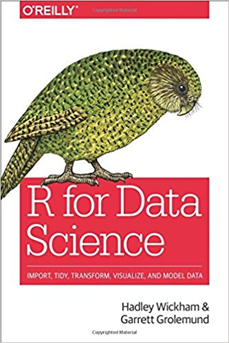
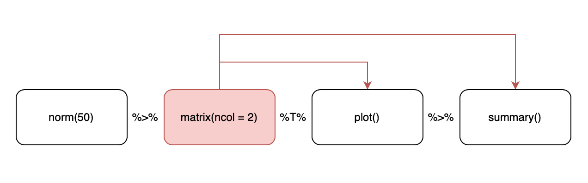

exclude: true
count: false

```{r,echo=FALSE,child="assets/header-presentation.Rmd"}
```

<!-- ----------------- Only edit title & author above this ----------------- -->

```{r setup,include=FALSE}
knitr::opts_chunk$set(dev="png",results="hold",fig.show="hold",fig.align="left",echo=TRUE,warning=FALSE,message=FALSE)

# report related
library(knitr)
library(markdown)
library(rmarkdown)
```

```{r,echo=FALSE,message=FALSE,warning=FALSE}
# load the packages you need

library(tidyverse)
library(ggplot2) # static graphics
library(kableExtra)
library(magrittr)
library(emo)
```

---
name: learning_outcomes
## Learning Outcomes

When this module is complete, you will:

* know what `tidyverse` is and a bit about its history
* be able to use different pipes, including advanced ones and placeholders
* know whether the data you work with are tidy
* will be able to load, debug and tidy your data
* understand how to combine datasets using `join_*` 
* be aware of useful packages within tidyverse

---
name: tidyverse
## Tidyverse &mdash; what is it all about?

* [tidyverse](http://www.tidyverse.org) is a collection of packages `r emo::ji('package'); emo::ji('package')` 
* created by [Hadley Wickham](http://hadley.nz)
* gains popularity `r emo::ji('chart_increasing')`, on the way to become a *de facto* standard in data analyses
* knowing how to use it can increase your salary `r emo::ji('money_bag')` 
* a philosophy of programming or a programming paradigm
* everything is about `r emo::ji('water_wave')` the flow of `r emo::ji('broom')` *tidy data*

--

.center[



]

.vsmall[sources of images: www.tidyverse.org, Wikipedia, www.tidyverse.org]

---
name: tidyverse_workflow

## Typical Tidyverse Workflow
`r emo::ji('skull_and_crossbones')` The tidyverse curse? `r emo::ji('skull_and_crossbones')`<br><br>
--
*Navigating the balance between base R and the tidyverse is a challenge to learn.*
.right[.small[-- [Robert A. Muenchen](http://r4stats.com/articles/why-r-is-hard-to-learn/)]]
<br><br>
--
<br>
.vsmall[source: http://www.storybench.org/getting-started-with-tidyverse-in-r/]  

---
name: intro_to_pipes
## Introduction to Pipes
.pull-left-50[
  .center[
    ```{r, echo=F, out.width=300}
    knitr::include_graphics("assets_tidyverse/MagrittePipe.jpg")
    ```
  ]
  .vsmall[
    Rene Magritt, *[La trahison des images](https://en.wikipedia.org/wiki/The_Treachery_of_Images)*, [Wikimedia Commons](https://en.wikipedia.org/wiki/The_Treachery_of_Images#/media/File:MagrittePipe.jpg)
  ]
  <br>&nbsp;
  .center[
    ```{r, echo=F, out.width=150}
    knitr::include_graphics("assets_tidyverse/magrittr.png")
    ```
  ]
]
--
.pull-right-50[
* let the data flow `r emo::ji('water_wave')`...
* `magrittr` package &mdash; `tidyverse` and beyond
* the `%>%` pipe
  + `x %>% f` $\equiv$ `f(x)`
  + `x %>% f(y)` $\equiv$ `f(x, y)`
  + `x %>% f %>% g %>% h` $\equiv$ `h(g(f(x)))`
]
--
.pull-right-50[
instead of writing this:
```{r magrittr0, eval=F}
data <- iris
data <- head(data, n=3)
```
]
--
.pull-right-50[
write this:
```{r magrittr1}
iris %>% head(n=3)
```
]

---
name: other_pipes_T
## Other Types of Pipes &mdash; `%T>%`

* provided by `magritter`, not in `tidyverse`

* when you call a function for its side effects

```{r magrittr2a, fig.height=4, fig.width=4, error=TRUE, tidy=FALSE} 
rnorm(50) %>% 
  matrix(ncol = 2) %>% 
  plot() %>% 
  summary()
```

---
name: other_pipes_T_2
## Other Types of Pipes &mdash; `%T>%`


--

```{r magrittr2b, fig.height=4, fig.width=4, echo=FALSE} 
rnorm(50) %>% 
  matrix(ncol = 2) %T>% 
  plot() %>% 
  summary()
```
---
name: the_splitting_pipe

## Other Types of `magrittr` Pipes &mdash; `%$%`
```{r dollar_pipe1, error=T}
iris %>% cor(Sepal.Length, Sepal.Width)
```

--

We need the `%$%` pipe with exposition of variables:

```{r dollar_pipe2}
iris %$% cor(Sepal.Length, Sepal.Width)
```

--

This is because the `cor` function does not have the `data` argument (which also should be the first argument of a pipe-friendly function).

---
name: pipes_two_way 
## Other Types of `magrittr` Pipes &mdash; %<>%

> It exists but can lead to somewhat confusing code! `r emo::ji('danger')`

`x %<>% f` $\equiv$ `x <- f(x)`
```{r the_two-way_pipe}
M <- matrix(rnorm(16), nrow=4)
M %<>% colSums()
M
```
---
name: magrittr_placeholder

## Placeholders in `magrittr` Pipes
Sometimes we want to pass the resulting data to *other than the first* argument of the next function in chain. `magritter` provides placeholder mechanism for this:
* `x %>% f(y, .)` $\equiv$ `f(y, x)`,
* `x %>% f(y, z = .)` $\equiv$ `f(y, z = x)`.

But for nested expressions:
* `x %>% f(a = p(.), b = q(.))` $\equiv$ `f(x, a = p(x), b = q(x))`,
* `x %>% {f(a = p(.), b = q(.))}` $\equiv$ `f(a = p(x), b = q(x))`.  

Examples:
```{r magrittr_placeholder_example1}
M <- rnorm(4) %>% matrix(nrow = 2)
M %>% `%*%`(., .)
```

```{r magrittr_placeholder_example2}
print_M_summ <- function(nrow, ncol) {
  paste0('Matrix M has: ', nrow, ' rows and ', ncol, ' columns.')
}
M %>% {print_M_summ(nrow(.), ncol(.))}
```

---
name: tibble_intro

## Tibbles
.pull-left-50[
  ```{r, fig.align='center', echo=FALSE}
  knitr::include_graphics("assets_tidyverse/hex-tibble.png")
  ```
  ```{r}
  as_tibble(iris)
  ```
]

.pull-right-50[
* `tibble` is one of the unifying features of tidyverse,
* it is a *better* `data.frame` realization,
* objects `data.frame` can be coerced to `tibble` using `as_tibble()`

```{r tibble_from_scratch}
  tibble(
    x = 1,          # recycling
    y = runif(50), 
    z = x + y^2,
    outcome = rnorm(50)
  )
```
]

---
name: tibble2

## More on Tibbles

* When you print a `tibble`:
  + all columns that fit the screen are shown,
  + first 10 rows are shown,
  + data type for each column is shown.

```{r tibble_printing} 
as_tibble(cars)
```

* `my_tibble %>% print(n = 50, width = Inf)`,
* `options(tibble.print_min = 15, tibble.print_max = 25)`,
* `options(dplyr.print_min = Inf)`,
* `options(tibble.width = Inf)`

---
name: tibble2

## Subsetting Tibbles

```{r tibble_subs}
vehicles <- as_tibble(cars[1:5,])

vehicles[['speed']]
vehicles[[1]]
vehicles$speed

# Using placeholders

vehicles %>% .$dist
vehicles %>% .[['dist']]
vehicles %>% .[[2]]
```
--
**Note!** Not all old R functions work with tibbles, than you have to use `as.data.frame(my_tibble)`.

---
name: tibbles_partial_matching

## Tibbles are Stricter than `data.frames`
```{r tibble_strict, warning=T, echo=F}
cars <- cars[1:5,]
```
```{r tibble_strict1, warning=T}
cars$spe      # partial matching
```
```{r tibble_strict2, warning=T}
vehicles$spe  # no partial matching
```
```{r tibble_strict3, warning=T}
cars$gear
```
```{r tibble_strict4, warning=T}
vehicles$gear
```

---
name: loading_data

## Loading Data
In `tidyverse` you import data using `readr` package that provides a number of useful data import functions:
* `read_delim()` a generic function for reading *-delimited files. There are a number of convenience wrappers:
  + `read_csv()` used to read comma-delimited files,
  + `read_csv2()` reads semicolon-delimited files, 
  `read_tsv()` that reads tab-delimited files.
* `read_fwf` for reading fixed-width files with its wrappers:
  + fwf_widths() for width-based reading,
  + fwf_positions() for positions-based reading and
  + read_table() for reading white space-delimited fixed-width files.
* `read_log()` for reading Apache-style logs.

The most commonly used `read_csv()` has some familiar arguments like:
* `skip` -- to specify the number of rows to skip (headers),
* `col_names` -- to supply a vector of column names,
* `comment` -- to specify what character designates a comment,
* `na` -- to specify how missing values are represented.

---
name: parse_functions

## Under the Hood -- `parse_*` Functions 
Under the hood, data-reading functions use `parse_*` functions:

```{r} 
parse_double("42.24")
```

```{r} 
parse_number("272'555'849,55", 
             locale = locale(decimal_mark = ",", 
                             grouping_mark = "'"
                            )
             )
```

```{r} 
parse_number(c('100%', 'price: 500$', '21sek', '42F'))
```

---
name: parsing_strings

## Parsing Strings

* Strings can be represented in different encodings:
```{r encodings, include=TRUE}
text1 <- 'På en ö är en å'
text2 <- 'Zażółć gęślą jaźń'
```
```{r encodings2}
text1
charToRaw(text2)
parse_character(text1, locale = locale(encoding = 'UTF-8'))
guess_encoding(charToRaw("Test"))
guess_encoding(charToRaw(text1))
``` 

---
name: parsing_factors

## Parsing Factors

* R is using factors to represent cathegorical variables. 
* Supply known levels to `parse_factor` so that it warns you when an unknown level is present in the data:
```{r, error=T, warning=T}
landscapes <- c('mountains', 'swamps', 'seaside')
parse_factor(c('mountains', 'plains', 'seaside', 'swamps'), 
             levels = landscapes)
```
---
name: parsing_other_functions

## Other Parsing Functions

`parse_`
* `vector`, `time`, `number`, `logical`, `integer`, `double`, `character`, `date`, `datetime`,
* `guess`

```{r parse_guess}
guess_parser("2018-06-11 09:00:00")
parse_guess("2018-06-11 09:00:00")

guess_parser(c(1, 2.3, "23$", "54%"))
parse_guess(c(1, 2.3, "23$", "54%"))
```

---
name: readr

## Importing Data Using `readr`

When reading and parsing a file, `readr` attempts to guess proper parser for each column by looking at the 1000 first rows.
```{r tricky_dataset, echo=TRUE, message=TRUE, warning=T}
tricky_dataset <- read_csv(readr_example('challenge.csv'))
```
OK, so there are some parsing failures. We can examine them more closely using `problems()` as suggested in the above output.

---
name: readr_problems
## Looking at Problematic Columns

```{r tricky_dataset_problems}
p <- problems(tricky_dataset)
p
```
OK, let's see which columns cause trouble:
```{r problems_table}
p %$% table(col)
```
Looks like the problem occurs only in the `y` column.

---
name: readr_problems_fixing
## Fixing Problematic Columns
So, how can we fix the problematic columns?

We can explicitely tell what parser to use:
```{r fix_problematic_explicite_parser, echo=TRUE, message=TRUE, warning=T}
tricky_dataset <- read_csv(readr_example('challenge.csv'),
                           col_types = cols(x = col_double(),
                                            y = col_character()
                                            )
                                                      )
tricky_dataset %>% tail(n = 5)
```
As you can see, we can still do better by parsing the `y` column as *date*, not as *character*. 

---
name: readr_problems_fixing2
## Fixing Problematic Columns cted.
But knowing that the **parser is guessed based on the first 1000 lines**, we can see what sits past the 1000-th line in the data:
```{r}
tricky_dataset %>% head(n = 1002) %>% tail(n = 4)
```
It seems, we were very unlucky, because up till the 1000-th line there are only integers in the `x` column and `NA`s in the `y` column so the parser cannot be guessed correctly. To fix this:
```{r guess_max_fix, echo=TRUE, message=TRUE, warning=T}
tricky_dataset <- read_csv(readr_example('challenge.csv'),
                           guess_max = 1001)
```

---
name: readr_writing
## Writing to a File
The `readr` package also provides functions useful for writing tibbled data into a file:

* `write_csv()`
* `write_tsv()`
* `write_excel_csv()`

They **always** save:

* text in UTF-8,
* dates in ISO8601

But saving in csv (or tsv) does mean you loose information about the type of data in particular columns. You can avoid this by using:

* `write_rds()` and `read_rds()` to read/write objects in R binary rds format,
* use `write_feather()` and `read_feather()` from package `feather` to read/write objects in a fast binary format that other programming languages can access.

---
name: basic_data_transformations
## Basic Data Transformations with `dplyr`

Let us create a tibble:
```{r}
bijou <- as_tibble(diamonds) %>% head(n = 100)
bijou
```

.center[
  
]
---
name: filter
## Picking Observations using `filter()`
```{r}
bijou %>% filter(cut == 'Ideal' | cut == 'Premium', carat >= 0.23) %>%
  head(n = 5)
```
Be careful with floating point comparisons! Also, rows with comparison resulting in `NA` are skipped by default!
```{r}
bijou %>% filter(near(0.23, carat) | is.na(carat)) %>%
  head(n = 5)
```

---
name: arrange
## Rearranging Observations using `arrange()`
```{r}
bijou %>% arrange(cut, carat, desc(price))
```
The `NA`s always end up at the end of the rearranged tibble.

---
name: select
## Selecting Variables with `select()`
Simple `select` with a range:
```{r}
bijou %>% select(color, clarity, x:z) %>% head(n = 5)
```
--
Exclusive `select`:
```{r}
bijou %>% select(-(x:z)) %>% head(n = 5)
```

---
name: select2
## Selecting Variables with `select()` cted.
`rename` is a variant of `select`, here used with `everything()` to move `x` to the beginning and rename it to `var_x` 
```{r}
bijou %>% rename(var_x = x) %>% head(n = 5)
```
--
use `everything()` to bring some columns to the front:
```{r}
bijou %>% select(x:z, everything()) %>% head(n = 5)
```

---
name: mutate
## Create/alter new Variables with `mutate` 
```{r}
bijou %>% mutate(p = x + z, q = p + y) %>% select(-(depth:price)) %>% head(n = 5)
```
--
or with `transmute` (only the transformed variables will be retained)
```{r}
bijou %>% transmute(carat, cut, sum = x + y + z) %>% head(n = 5)
```

---
name: grouped_summaries
## Group and Summarize
```{r}
bijou %>% group_by(cut) %>% summarize(max_price = max(price),
                                      mean_price = mean(price),
                                      min_price = min(price))
```
--
```{r}
bijou %>% 
  group_by(cut, color) %>% 
  summarize(max_price = max(price), 
            mean_price = mean(price), 
            min_price = min(price)) %>% head(n = 5)
```

---
name: other_data_manipulations
## Other data manipulation tips
```{r}
bijou %>% group_by(cut) %>% summarize(count = n())
```
--
When you need to regroup within the same pipe, use `ungroup()`.
---
name: concept_of_tidy_data

## The Concept of Tidy Data
Data are tidy *sensu Wickham* if:
* each and every observation is represented as exactly one row,
* each and every variable is represented by exactly one column,
* thus each data table cell contains only one value.
`r knitr::include_graphics("assets_tidyverse/tidy_data.png")`

Usually data are untidy in only one way. However, if you are unlucky, they are really untidy and thus a pain to work with...
---
name: tidy_data

## Tidy Data

--
.center[**Are these data tidy?**]

.pull-left-70[
```{r tidy_iris1, echo=FALSE}
data("iris") 
iris %>% head(n=3) %>% kable("html",escape=F,align="c") %>%
  kable_styling(bootstrap_options=c("striped","hover","responsive","condensed"),
                position="left",full_width = F)
```
]
--
.pull-right-30[
```{r tidy_iris2, echo=FALSE}
iris2 <- iris %>% 
  gather(key=variable, value=value, -Species)
iris2 %>%
  head(n=3) %>%
  kable("html",escape=F,align="c") %>% 
  kable_styling(bootstrap_options=c("striped","hover","responsive","condensed"),
                position="left",full_width = F)
```
]
<br>&nbsp;<hr><br>

--
.pull-left-50[
```{r tidy_iris3, echo=FALSE}
iris3 <-
  iris %>% 
  unite(Sepal.L.W, Sepal.Length, Sepal.Width, sep = "/") %>% 
  unite(Petal.L.W, Petal.Length, Petal.Width, sep = "/")
iris3 %>%
  head(n = 3) %>%
  kable("html",escape=F,align="c") %>% 
  kable_styling(bootstrap_options=c("striped","hover","responsive","condensed"),
                position="left",full_width = F)
```
]
--
.pull-right-50[
```{r tidy_iris4, echo=FALSE}
iris4 <- t(iris) 
iris4[,1:4] %>%
  kable("html",escape=F,align="c") %>% 
  kable_styling(bootstrap_options=c("striped","hover","responsive","condensed"),
                position="left",full_width = F)
```
]

---
name: tidying_data_gather
## Tidying Data with `pivot_longer`

If some of your column names are actually values of a variable, use `pivot_longer` (old `gather`):

```{r include=FALSE}
bijou %>% 
  mutate(`2008` = price) %>% 
  select(-price) %>% 
  mutate(`2009` = `2008` + floor(sample(rnorm(100, mean = 0.01 * mean(`2008`)), 
                                size = 1, 
                                replace=T
                                ))
         ) %>%
  select(cut, `2008`, `2009`) -> bijou2
```
```{r bijou2}
bijou2 %>% head(n = 5)
```
```{r}
bijou2 %>% 
  pivot_longer(cols = c(`2008`, `2009`), names_to = 'year', values_to = 'price') %>% 
  head(n = 5)
```

---
name: tidying_data_spread
## Tidying Data with `pivot_wider`

If some of your observations are scattered across many rows, use `pivot_wider` (old `spread`):

```{r include=FALSE}
bijou %>% head(n = 3) %>% select(cut, price, clarity, x, y, z) %>% gather(x,y,z, key='dimension', value='measurement') -> bijou3
```
```{r bijou3}
bijou3
```
```{r}
bijou3 %>% 
  pivot_wider(names_from = dimension, values_from = measurement) %>% 
  head(n = 5)
```

---
name: tidying_data_separate
## Tidying Data with `separate`

If some of your columns contain more than one value, use `separate`:

```{r include=FALSE}
bijou %>% head(n = 5) %>% select(cut, price, clarity, x, y, z) %>% unite(dim, x, y, z, sep='/') -> bijou4
```
```{r bijou4}
bijou4
```
```{r}
bijou4 %>% 
  separate(dim, into = c("x", "y", "z"), sep = "/", convert = T)
```

---
name: tidying_data_separate
## Tidying Data with `unite`

If some of your columns contain more than one value, use `separate`:

```{r include=FALSE}
bijou %>% head(n = 5) %>% select(cut, price, clarity, x, y, z) %>% separate(clarity, into = c('clarity_prefix', 'clarity_suffix'), sep = 2) -> bijou5
```
```{r bijou5}
bijou5
```
```{r}
bijou5 %>% unite(clarity, clarity_prefix, clarity_suffix, sep='')
```
**Note:** that `sep` is here interpreted as the position to split on. It can also be a *regular expression* or a delimiting string/character. Pretty flexible approach!

---
name: missing_complete
## Completing Missing Values Using `complete`
```{r eval=FALSE, include=FALSE}
bijou %>% 
  head(n = 10) %>% 
  select(cut, clarity, price) %>% 
  mutate(cut, cut2=replace(cut, sample(1:10, 4, F), NA)) -> missing_stones
```
```{r}
bijou %>% head(n = 10) %>% 
  select(cut, clarity, price) %>% 
  mutate(continent = sample(c('AusOce', 'Eur'), 
                            size = 10, 
                            replace = T)) -> missing_stones
```
```{r}
missing_stones %>% complete(cut, continent)
```

---
name: joins
## Combining Datasets
Often, we need to combine a number of data tables (relational data) to get the full picture of the data. Here different types of *joins* come to help:

--
* *mutating joins* that add new variables to data table `A` based on matching observations (rows) from data table `B`

--

* *filtering joins* that filter observations from data table `A` based on whether they match observations in data table `B`

--

* *set operations* that treat observations in `A` and `B` as elements of a set.

--

Let us create two example tibbles that share a key:
.pull-left-50[
```{r, echo=FALSE}
A <- tribble(
  ~key, ~x,
  'a', 'A1',
  'b', 'A2',
  'c', 'A3',
  'e','A4'
)
```
```{r, echo=FALSE}
knitr::kable(A)
```
]
.pull-right-50[
```{r, echo=FALSE}
B <- tribble(
  ~key, ~y,
  'a', 'B1',
  'b', NA,
  'c', 'B3',
  'd','B4'
)
```
```{r, echo=FALSE}
knitr::kable(B)
```
]

---
name: inner_join
## The Joins Family &mdash; `inner_join`

.pull-left-50[
```{r, echo=FALSE}
knitr::kable(A)
```
]
.pull-right-50[
```{r, echo=FALSE}
knitr::kable(B)
```
]

--
<br><br>
```{r}
A %>% inner_join(B, by = 'key')
# All non-matching rows are dropped!
```

---
name: left_join
## The Joins Family &mdash; `left_join`

.pull-left-50[
```{r, echo=FALSE}
knitr::kable(A)
```
]
.pull-right-50[
```{r, echo=FALSE}
knitr::kable(B)
```
]

--

<br><br>

```{r}
A %>% left_join(B, by = 'key')
```

---
name: right_join
## The Joins Family &mdash; `right_join`

.pull-left-50[
```{r, echo=FALSE}
knitr::kable(A)
```
]
.pull-right-50[
```{r, echo=FALSE}
knitr::kable(B)
```
]

--

<br><br>
 
```{r}
A %>% right_join(B, by = 'key')
```

---
name: full_join
## The Joins Family &mdash; `full_join`

.pull-left-50[
```{r, echo=FALSE}
knitr::kable(A)
```
]
.pull-right-50[
```{r, echo=FALSE}
knitr::kable(B)
```
]

--

<br><br>
 
```{r}
A %>% full_join(B, by = 'key')
```

---
name: more_tidyverse
## Some Other Friends
* `stringr` for string manipulation and regular expressions,
* `forcats` for working with factors,
* `lubridate` for working with dates.
---
name: end-slide
class: end-slide

# Thank you

---
name: report

## Session  

* This presentation was created in RStudio using [`remarkjs`](https://github.com/gnab/remark) framework through R package [`xaringan`](https://github.com/yihui/xaringan).
* For R Markdown, see <http://rmarkdown.rstudio.com>
* For R Markdown presentations, see <https://rmarkdown.rstudio.com/lesson-11.html>

```{r,echo=TRUE}
R.version
```
